# Solar Microgrid Project (archived)
> Raw extract từ `Solar Microgrid Project.pdf` (PyMuPDF). Text + ảnh gốc, chưa chỉnh sửa.
> Số trang: 17

---

## Trang 1

ĐỒ ÁN MÔN HỌC KỸ THUẬT MÁY TÍNH
Thiết kế và xây dựng mô
hình microgrid sử dụng năng
lượng mặt trời chi phí thấp
kết hợp IoT
GVHD: TS. Lê Trọng Nhân | ThS. Phạm Công Thái
Sinh viên thực hiện: Phan Lê Hậu, Nguyễn Đăng Tuấn Tài, Nguyễn Công Vũ
Trường Đại học Bách Khoa - ĐHQG TP.HCM

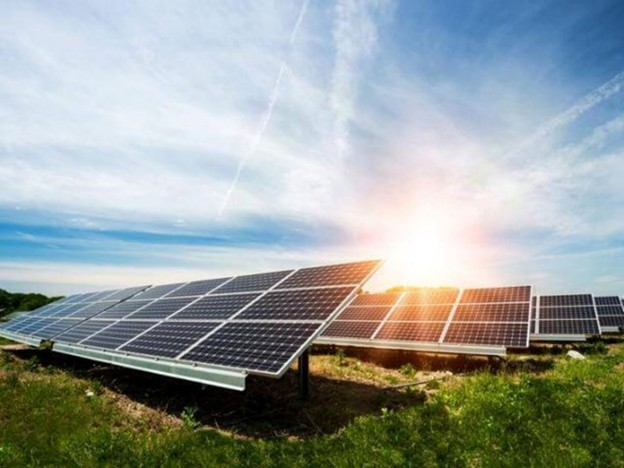

## Trang 2

Giới thiệu về đề tài
Bối cảnh & Vấn đề
Nhu cầu năng lượng tái tạo ngày càng tăng, đặc biệt tại
các vùng sâu, vùng xa và hải đảo nơi lưới điện quốc gia
khó tiếp cận. Việc sử dụng máy phát điện Diesel gây ô
nhiễm môi trường và chi phí vận hành cao.
Giải pháp đề xuất
Nghiên cứu và xây dựng mô hình Microgrid quy mô
nhỏ (Off-grid) sử dụng năng lượng mặt trời.
Chi phí thấp, dễ triển khai.

Sử dụng pin Lithium-ion thay cho ắc quy chì.

Kết hợp IoT để giám sát và điều khiển từ xa.


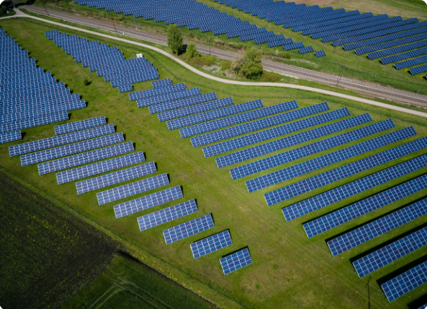

## Trang 3

Tổng quan & Thành phần Microgrid
Khái niệm
Microgrid là một hệ thống điện cục bộ tích hợp các
nguồn phát phân tán (DERs), hệ thống lưu trữ và tải tiêu
thụ, có khả năng vận hành tự chủ hoặc kết nối với lưới
điện chính.
6 Thành phần cốt lõi
1. DERs (Nguồn phân tán): Pin mặt trời (PV),
Tuabin gió, Máy phát Diesel.

2. ESS (Hệ thống lưu trữ): Pin Li-ion, Ắc quy
chì, Siêu tụ điện.

3. Bộ biến đổi (Converter): Inverter (DC/AC),
Buck/Boost (DC/DC).

4. EMS (Quản lý năng lượng): Điều phối
nguồn và tải tối ưu.

5. Tải (Loads): Tải ưu tiên (Critical) và không
ưu tiên.

6. IoT Monitoring: Giám sát thông số và cảnh
báo từ xa.


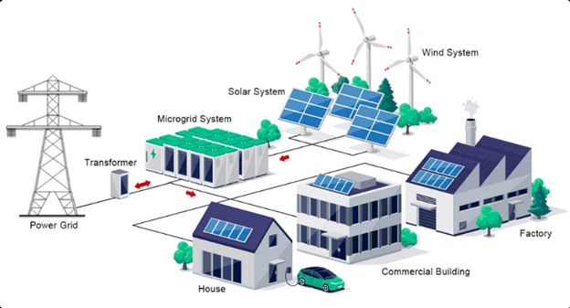

## Trang 4

Phân loại Microgrid

1. Grid-connected
Hoạt động song song và kết
nối trực tiếp với lưới điện
quốc gia.
Đặc điểm: Ổn định cao, giảm chi
phí lưu trữ, có thể bán điện dư
thừa.
2. Isolated (Off-grid)
Vận hành độc lập hoàn toàn,
không kết nối lưới điện. (Lựa
chọn của đề tài)
Đặc điểm: Tự chủ 100%, phù
hợp hải đảo, cần hệ thống lưu trữ
lớn.

3. Hybrid Microgrid
Kết hợp đa dạng nguồn năng
lượng (PV, Gió, Diesel, Pin)
trong một hệ thống.
Đặc điểm: Độ tin cậy cao nhất,
vận hành linh hoạt, giảm phụ
thuộc thời tiết.

## Trang 5

So sánh Ưu & Nhược điểm các loại Microgrid
LOẠI MICROGRID
ƯU ĐIỂM
HẠN CHẾ
Grid-connected
Ổn định cao, chi phí lưu trữ thấp, bán điện
lên lưới.
Ngừng hoạt động khi lưới điện gặp sự cố (Anti-
islanding).
Isolated (Off-
grid)
Tự chủ hoàn toàn năng lượng, dễ triển khai
ở vùng xa.
Chi phí đầu tư Pin lưu trữ lớn, phụ thuộc thời
tiết.
Hybrid
Linh hoạt, độ tin cậy cao, tối ưu hóa các
nguồn phát.
Cấu trúc điều khiển phức tạp, chi phí bảo trì
cao.

## Trang 6

Tổng quan
năng lượng
mặt trời
Việt Nam có tiềm năng bức xạ mặt trời
cao (trung bình 4.5-5.5 kWh/m²/ngày),
rất thuận lợi để phát triển điện mặt trời
độc lập.
Công nghệ Pin Mono-
crystalline
Hiệu suất chuyển đổi cao
(18-22%).

Hoạt động tốt trong điều kiện
nắng mạnh.

Độ bền cao, phù hợp với môi
trường khắc nghiệt.

Kích thước nhỏ gọn, tối ưu
diện tích lắp đặt.


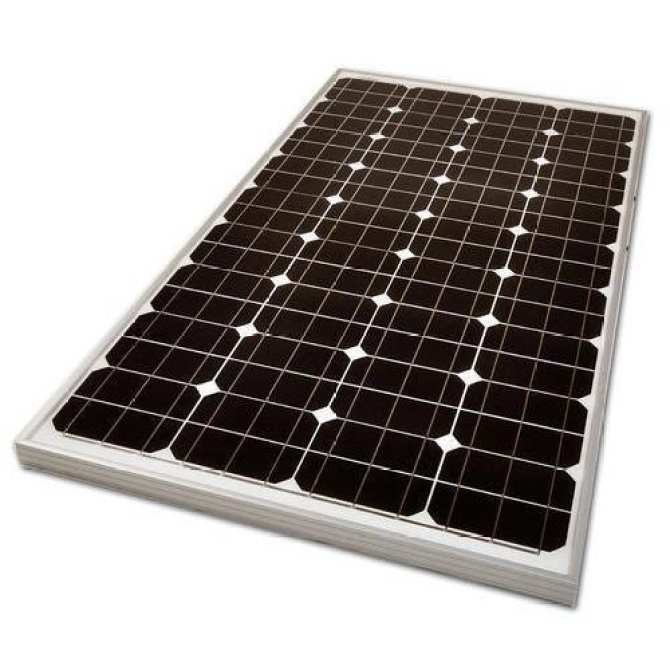

## Trang 7

Tổng quan hệ thống lưu trữ năng lượng
So sánh các công nghệ lưu trữ phổ biến để lựa chọn giải pháp tối ưu cho Microgrid chi phí
thấp.
Vòng đời (Chu kỳ sạc/xả)
Ắc quy Chì-Axit
300-500
Li-ion (18650)
1000-2000
LiFePO4
3000+
Hiệu suất năng lượng
Ắc quy Chì-Axit
70-80%
Li-ion / LiFePO4
90-95%
Lựa chọn: Pin Li-ion 18650 vì mật độ năng lượng cao, dễ ghép nối và chi phí hợp lý.

## Trang 8

Phân tích yêu cầu hệ thống: Vận hành

Vận hành Off-grid
Hệ thống phải tự chủ hoàn
toàn năng lượng, không phụ
thuộc vào lưới điện quốc gia.
Tự động chuyển đổi giữa
nguồn PV và Pin lưu trữ.

An toàn & Kiểm soát
Bảo vệ quá sạc, quá xả, quá
dòng. Duy trì điện áp đầu ra
ổn định (5V/12V DC) cho các
thiết bị tải.

Giám sát IoT
Thu thập dữ liệu điện áp,
dòng điện, SOC theo thời
gian thực. Cảnh báo lỗi và hỗ
trợ giám sát từ xa.

## Trang 9

Phân tích yêu cầu hệ thống: Kỹ thuật
Thông số Nguồn & Lưu trữ
Hệ thống BMS & Điều khiển
Nguồn PV: Công suất 40-60W, hiệu suất
~20%.

Pin lưu trữ: Li-ion 18650, cấu hình 3S (12V),
dung lượng 10-20Ah.

Ổn áp: Đầu ra DC sai số < ±5%.

BMS: Giám sát điện áp từng cell, cân bằng
cell thụ động.

Giao tiếp: Hỗ trợ UART/I2C để kết nối với vi
điều khiển.

An toàn điện: Diode chống ngược, Cầu
chì/MCB bảo vệ quá dòng.


## Trang 10

Danh sách thiết bị: Nguồn & Lưu trữ
Tấm pin Mono 60W
Công suất: 60W | Vmp: ~18V | Imp: ~3.33A
Pin Li-ion 18650 (27 cell)
Cấu hình: 3S9P | Dung lượng: 16.2Ah | Điện áp: 12V

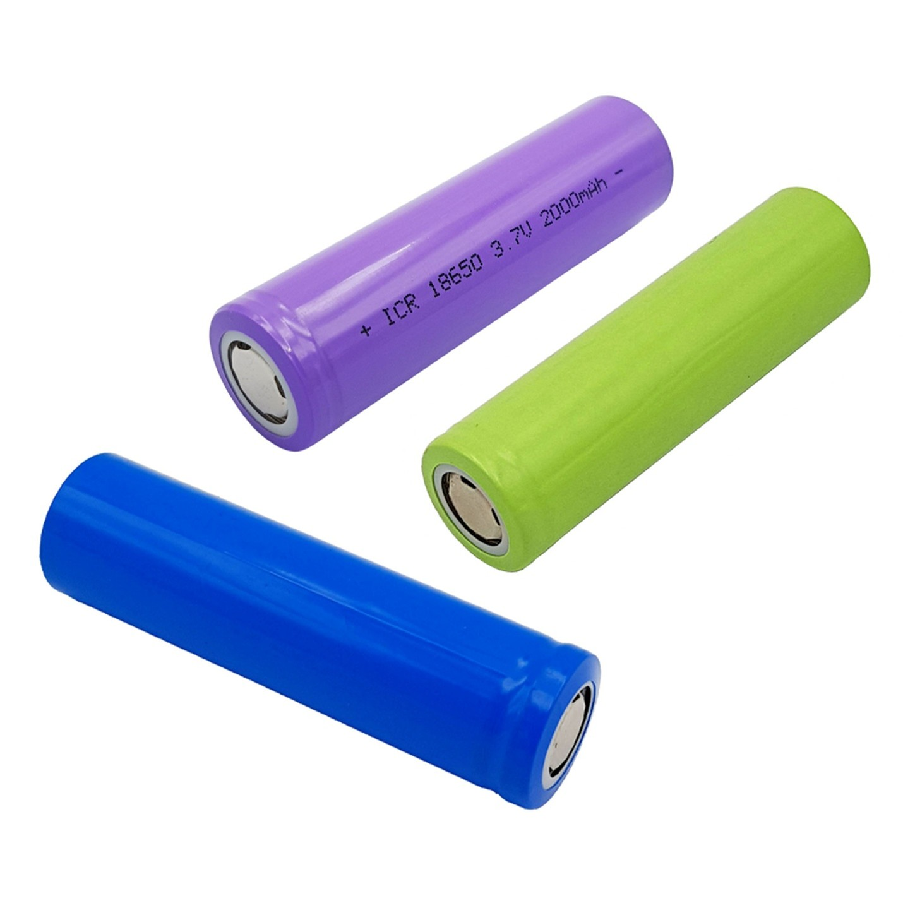

## Trang 11

Danh sách thiết bị: Điều khiển & Điện tử
Arduino Nano
Vi điều khiển trung tâm, thu
thập dữ liệu và điều khiển
Relay.
Cảm biến INA219
Đo dòng điện, điện áp và công
suất với độ chính xác cao qua
giao tiếp I2C.
Relay
Module Relay 5V để đóng cắt
tải và bảo vệ mạch.

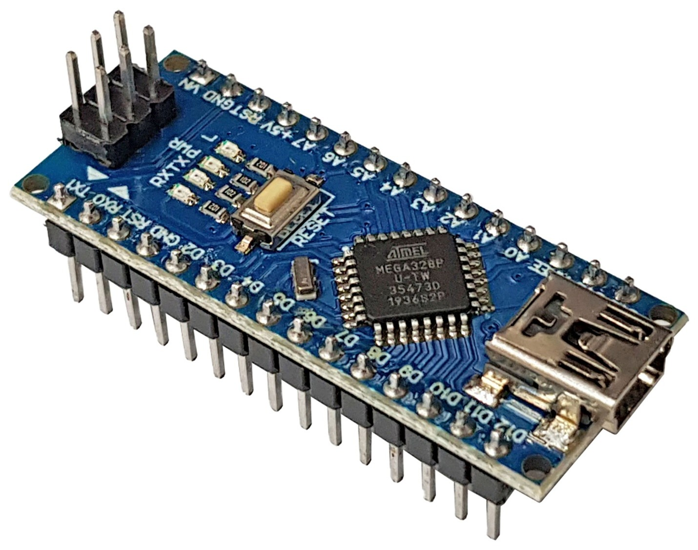

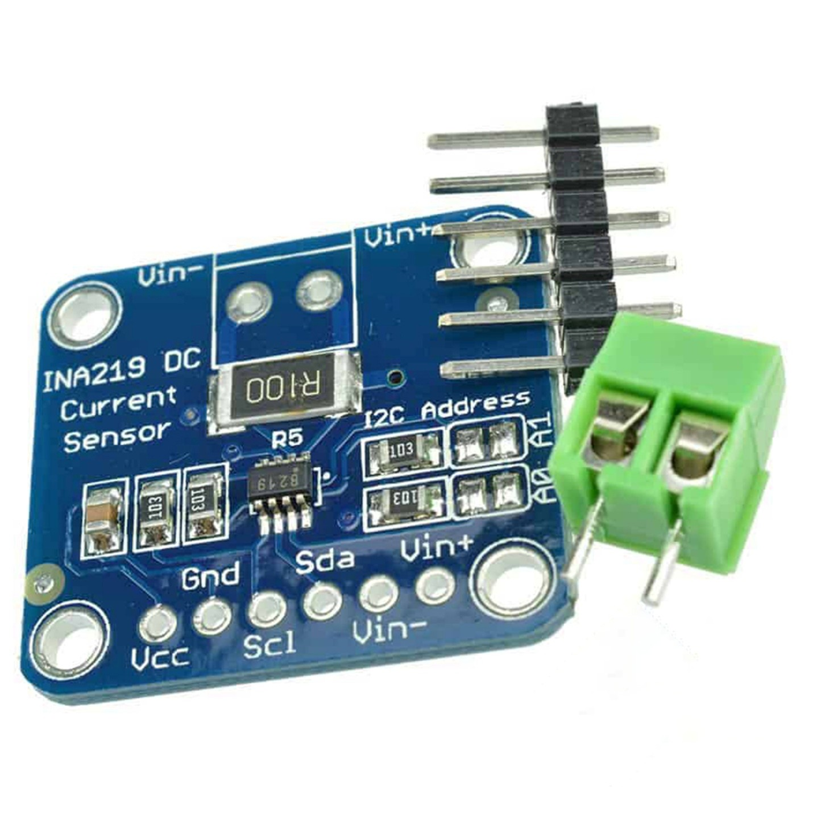

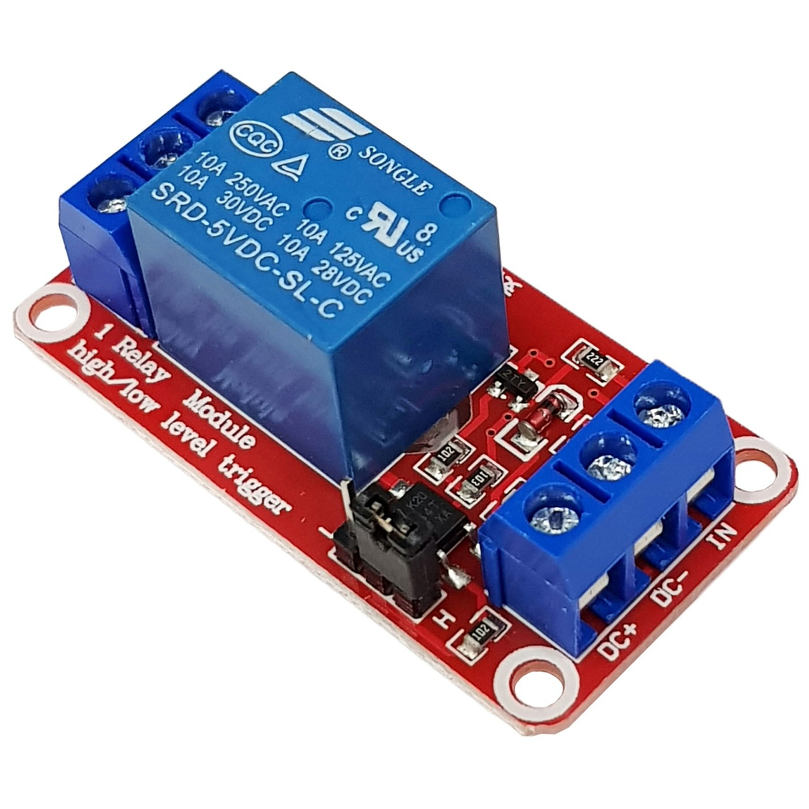

## Trang 12

Danh sách thiết bị: Ngoại vi & Phụ kiện
Màn hình LCD 16x2
Kèm module I2C. Hiển thị thông số điện
áp (V), dòng điện (I) và SOC trực quan,
tiết kiệm chân IO.
Opto PC817
Cách ly quang giữa mạch điều khiển 5V
và mạch công suất. Bảo vệ an toàn cho
Arduino.
Breadboard & Dây
Nền tảng lắp ráp và thử nghiệm mạch
nhanh chóng trong giai đoạn đầu của
dự án.
Linh kiện điện tử khác
Diode (chống ngược), Tụ điện (lọc
nhiễu), Điện trở... đảm bảo mạch hoạt
động ổn định.

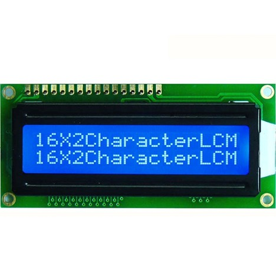

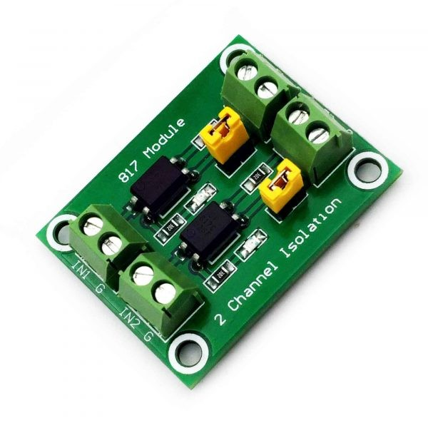

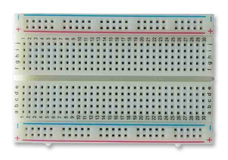

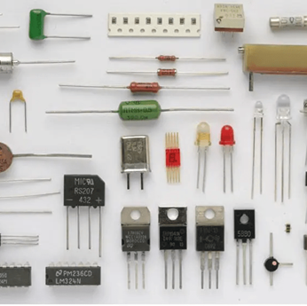

## Trang 13

Thiết kế hệ năng lượng
Kiến trúc hệ thống
Hệ thống được thiết kế theo luồng năng lượng một chiều:
PV Panel → Buck Converter → BMS → Battery Pack → Load
Tính toán năng lượng
Năng lượng PV: EPV = 60W × 4.5h × 0.8 ≈ 216 Wh/ngày

Lưu trữ: EBat = 12V × 16.2Ah ≈ 194.4 Wh

Khả năng cấp tải: Với tải trung bình 8W, hệ thống hoạt
động liên tục ~24 giờ.


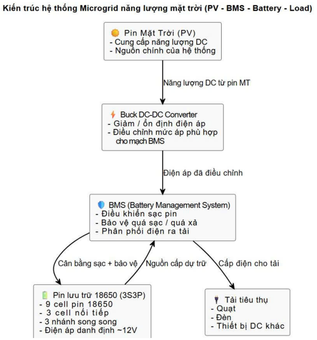

## Trang 14

Thiết kế hệ thống BMS
Chức năng cốt lõi
Giám sát Cell: Đo điện áp từng cell 18650
(3S) để phát hiện lệch áp.

Cân bằng Cell: Sử dụng phương pháp thụ
động (xả qua điện trở) khi phát hiện chênh
lệch áp.

Bảo vệ: Ngắt Relay khi áp > 3.9V (Quá sạc)
hoặc áp < 3.7V (Quá xả).

Giao tiếp: Truyền dữ liệu về Arduino Nano để
hiển thị lên LCD.


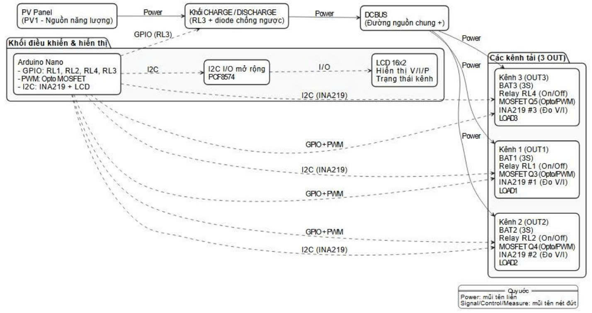

## Trang 15

Mô phỏng hệ thống BMS
Môi trường Proteus
Mô phỏng các trạng thái hoạt động của mạch BMS
trước khi thi công thực tế.
Kịch bản kiểm thử:
1. Chế độ Sạc: Kiểm tra ngắt khi áp đạt ngưỡng.
2. Chế độ Xả: Kiểm tra ngắt tải khi áp thấp.
3. Cân bằng: Quan sát dòng cân bằng khi các cell
lệch áp.

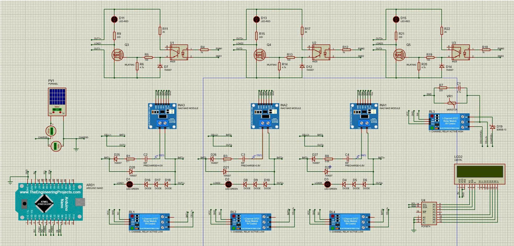

## Trang 16

Kết quả & Đánh giá
Xem video thực nghiệm
Kết quả thực nghiệm
Đánh giá
Mô hình đáp ứng tốt mục tiêu đề ra về mặt nguyên lý.
Tuy nhiên, độ chính xác của SOC còn phụ thuộc vào tải
và chưa có bảo vệ nhiệt độ chuyên sâu.
Sạc/Xả: Hệ thống hoạt động ổn định, chuyển
đổi mượt mà giữa các chế độ.

Hiển thị: LCD cập nhật đúng thông số điện áp
và SOC theo thời gian thực.

Cân bằng: Đèn báo trạng thái cell hoạt động
đúng logic (Cell đầy trước sẽ báo trước).


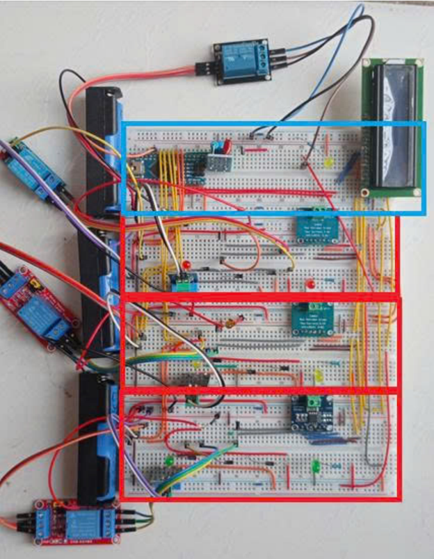

## Trang 17

Tổng kết & Kế hoạch giai đoạn 2
Kết luận: Đã xây dựng thành công mô hình Microgrid quy mô nhỏ, chi phí thấp với
hệ thống BMS tự thiết kế hoạt động ổn định.
Kế hoạch thực hiện (15 Tuần)
Tuần 1-4
Thiết kế mạch in (PCB)
hoàn chỉnh thay cho
Breadboard.
Tuần 5-8
Kết nối tấm Pin mặt trời
thực tế & Thử nghiệm
ngoài trời.
Tuần 9-12
Tối ưu mạch Buck-Boost
& Thuật toán SOC.
Tuần 13-15
Hoàn thiện Dashboard
IoT giám sát từ xa & Báo
cáo.
