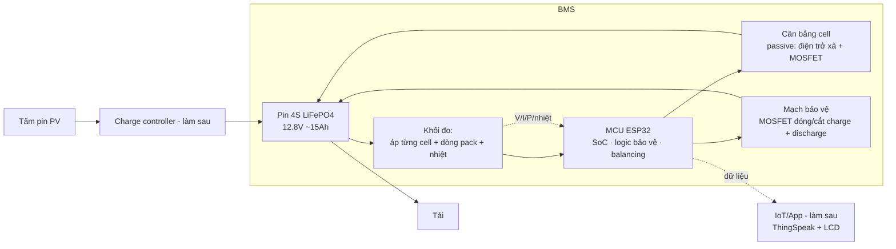
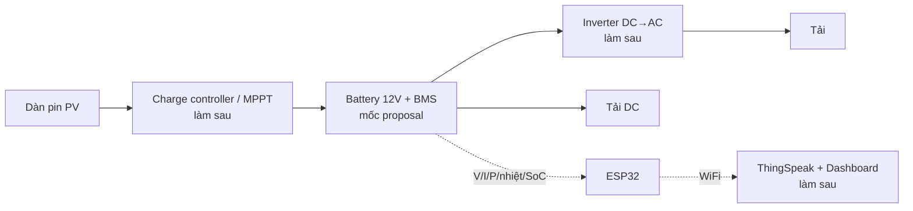

# Proposal GĐ1 — Thiết kế microgrid năng lượng mặt trời chi phí tối ưu kết hợp IoT

**Mã đề tài:** HK261-DAGD1-133
**GVHD:** ThS. Phạm Công Thái, TS. Lê Trọng Nhân
**Sinh viên:** Lê Thanh Phú (2212581), Phan Trần Nguyên Phúc (2212643), Hoàng Ngô Thiên Phúc (2212612)
**Tổ / Ngành:** Kỹ thuật Máy tính · **Mốc:** Báo cáo tiến độ GĐ1 (nộp LMS)

> Tài liệu này ở mức **tổng quan (phương pháp + kế hoạch + phân việc)** theo yêu cầu của thầy — chưa đi vào chi tiết linh kiện/PCB. Nguồn: [`../info/qa1.md`](../info/qa1.md) · Lý thuyết chắt lọc: [`../references/refs-extract.md`](../references/refs-extract.md) · Hướng dẫn dựng mô phỏng: [`simulation-guide.md`](simulation-guide.md).

---

## Mục lục

1. Giới thiệu & mục tiêu
2. Phạm vi (scope)
3. Điểm khác biệt & đóng góp dự kiến
4. Cơ sở lý thuyết
5. Đề xuất thiết kế BMS 12V (concept)
6. Kế hoạch mô phỏng Proteus
7. Tìm hiểu thuật toán PV array configuration
8. Sơ đồ khối hệ thống
9. Kế hoạch thực hiện & phân chia nhiệm vụ
10. Quyết định còn mở
11. Kết quả mong đợi
12. Tài liệu tham khảo

---

## 1. Giới thiệu & mục tiêu

Nhu cầu điện tái tạo tăng nhanh ở vùng sâu, vùng xa, hải đảo — nơi lưới quốc gia khó vươn tới và máy phát diesel thì đắt, ô nhiễm. Đề tài xây dựng **mô hình microgrid nhỏ dùng năng lượng mặt trời, chi phí tối ưu, tích hợp IoT** để giám sát/điều khiển từ xa.

Không chỉ nông thôn, xu hướng lắp điện mặt trời áp mái còn lan mạnh ở **thành phố** — nhưng ở đô thị, dàn pin **thường xuyên bị che một phần** bởi nhà cao tầng lân cận, cây xanh, bồn nước, cột điện, ống khói… Bóng râm cục bộ (partial shading) gây **tổn hao công suất phi tuyến** và **điểm nóng (hotspot)** làm hỏng cell — mất mát lớn hơn nhiều so với phần diện tích bị che. Đây chính là động lực cho phần **tìm hiểu thuật toán sắp xếp/đổi nối dàn pin (PV array configuration / reconfiguration)** trong đề tài: giữ được công suất cao ngay cả khi một phần dàn pin bị che, mà không phải tăng chi phí phần cứng.

**Mục tiêu GĐ1** (theo thầy chốt):

1. Thiết kế **BMS 12V** (SoC, nhiệt độ, cân bằng cell, mạch bảo vệ) ở mức concept.
2. **Mô phỏng chức năng trên Proteus** cho BMS + tấm pin, **trước khi** làm phần cứng.
3. **Tìm hiểu thuật toán PV array configuration** (chống bóng râm).
4. Nêu **phương pháp tổng quan + kế hoạch + phân chia nhiệm vụ**.

## 2. Phạm vi (scope)

> ⚠️ **Chỉ phần ở mốc proposal là do thầy chốt cứng.** Các thành phần ở cột phải (charge controller/MPPT, inverter, tải, IoT/app) là **yêu cầu tổng thể của đề tài theo [specs](../specifications/specs.md)** và **vẫn thuộc GĐ1/4041** — nhưng việc xếp chúng **làm sau mốc proposal** và mốc cụ thể là **nhóm tự đề xuất**, thầy chưa xác nhận. *("GĐ2" = đồ án tốt nghiệp, môn khác — ngoài scope.)*

|                | Mốc proposal (làm ngay)                                                                                                        | Sau mốc proposal — vẫn trong GĐ1/4041 (đề tài yêu cầu; nhóm dự kiến)                         |
| ---------------- | ------------------------------------------------------------------------------------------------------------------------- | ---------------------------------------------------------------------------------------- |
| **Làm**       | BMS 12V (concept) · mô phỏng Proteus (BMS + PV) · tìm hiểu PV array configuration · sơ đồ khối · kế hoạch | charge controller/MPPT · inverter · tải · IoT/app (dashboard) · phần cứng thật |
| **Công cụ**  | **Proteus** (mô phỏng — thầy chốt); MATLAB–Simulink *(chỉ nếu mô phỏng reconfiguration)*                      | Altium/KiCad (schematic + PCB), ESP32 + ThingSpeak                                     |
| **Chưa làm** | schematic sản xuất, PCB layout/routing, firmware chi tiết, mạch thật                                               | —                                                                                     |

## 3. Điểm khác biệt & đóng góp dự kiến

> Các đề tài microgrid + BMS phổ biến (và nhiều thiết kế tham khảo trên mạng) thường dừng ở mức **đo và hiển thị**. Nhóm định hướng vượt qua mức đó ở 4 điểm sau — vừa đúng thế mạnh **Kỹ thuật Máy tính** (thuật toán + firmware + IoT), vừa bám tiêu chí **"chi phí tối ưu"** trong tên đề tài. *(Phần ⚙️ làm ở mốc proposal; phần 🔜 làm sau proposal, vẫn trong 4041.)*

1. **⚙️ Ước lượng SoC bằng Coulomb counting + hiệu chỉnh OCV** thay vì chỉ đọc điện áp. Đọc áp cho sai số lớn khi pin đang tải; đếm điện tích ra/vào chính xác hơn — đây là phần "thuật toán chạy trên vi điều khiển", đúng chất KTMT. *(Chi tiết mục 5.3b.)*
2. **⚙️ Giám sát nhiệt độ pack + bảo vệ quá nhiệt** tích hợp ngay trong BMS mô phỏng. Nhiều thiết kế tham khảo bỏ qua cảm biến nhiệt dù đây là 1 trong 4 khối thầy yêu cầu.
3. **🔜 IoT hai chiều** — không chỉ đẩy số liệu lên dashboard để xem, mà **điều khiển ngược từ app** (ngắt tải, đổi chế độ) và **cảnh báo tự động** (pin nóng/yếu → thông báo về điện thoại). Nâng hệ từ "màn hình giám sát" thành "hệ điều khiển được".
4. **🔜 Định lượng "chi phí tối ưu"** — lập **BOM** và **so sánh chi phí** với phương án thương mại/tham khảo, chứng minh bằng con số thay vì nói chung chung.

*Stretch (không bắt buộc):* **mô phỏng reconfiguration chống shading chạy thật** trên MATLAB–Simulink (Ref 3) với số liệu trước/sau — phần học thuật tạo khác biệt rõ nếu còn thời gian.

## 4. Cơ sở lý thuyết (tóm tắt)

- **Đặc tính PV:** đường I–V / P–V; ở **STC** (G = 1000 W/m², T = 25 °C). Bức xạ G tăng → dòng tăng gần tuyến tính; nhiệt độ T tăng → điện áp giảm mạnh → công suất giảm. Mỗi tấm có **điểm công suất cực đại (MPP)**. *(Ref 1, Ref 3)*
- **Bóng râm (partial shading):** che một phần dàn pin gây **tổn hao phi tuyến** + hiện tượng **hotspot** (điểm nóng làm hỏng cell). **Bypass diode** giúp dòng "đi vòng" tránh hotspot nhưng vẫn mất một phần công suất. *(Ref 3)*
- **PV array configuration:** đổi cách nối các tấm (Series/Parallel/**TCT**…) và **reconfiguration** (ma trận chuyển mạch **DES** + **cân bằng bức xạ**) để giảm tổn hao khi bị che — tăng hiệu năng 10–50%. *(Ref 3)*
- **BMS:** giám sát **SoC/SoH**, **cân bằng cell**, bảo vệ quá/thấp áp – quá dòng – quá nhiệt; đo V/I/nhiệt; quy trình **mô phỏng Proteus trước, phần cứng sau**. *(Ref 2)*
- **IoT:** cảm biến → controller → **ESP32 (WiFi)** → cloud (**ThingSpeak**) → dashboard mobile + LCD tại chỗ. *(Ref 2 — dùng cho phần IoT làm sau)*

## 5. 🔋 Đề xuất thiết kế BMS 12V (concept)

### 5.1. Cấu hình pin đề xuất

- **Baseline khuyến nghị: LiFePO4 4S** (4 cell nối tiếp × 3.2V ≈ **12.8V**), dung lượng ~**15Ah** (≈ 190Wh).
  - Lý do: an toàn, tuổi thọ cao, và **có nhiều cell nối tiếp → phần "cân bằng cell" thầy yêu cầu mới có ý nghĩa** (ắc-quy SLA monoblock gần như không cân bằng được).
- **Phương án chi phí thấp: SLA 12V** (rẻ, dễ mua) — BMS đơn giản hơn (không cần cân bằng cell), nhưng nặng và tuổi thọ thấp.
- ⚠️ **Loại pin chưa chốt** (xem mục 10) — thiết kế dưới đây theo baseline LiFePO4 4S, ngưỡng SLA ghi kèm để đối chiếu.

### 5.2. Sơ đồ khối BMS

### 5.3. Bốn khối chức năng (theo yêu cầu thầy)

**a) Đo lường (Measurement)**

- **Áp từng cell:** cầu phân áp tại mỗi điểm nối cell → ADC (để mô phỏng được trong Proteus). Phần cứng thật có thể dùng AFE chuyên dụng (vd BQ76920) tích hợp sẵn đo cell + bảo vệ + balancing.
- **Dòng & công suất pack:** **INA226** (I²C, đo sẵn V–I–P) hoặc **shunt + op-amp**.
- **Nhiệt độ:** cảm biến **NTC 10k** / **LM35** gắn trên pack (Ref 2 dùng LM35).

**b) Ước lượng SoC (% pin)** — *(điểm khác biệt, mục 3.1)*

- **Coulomb counting** (tích phân dòng qua INA226/shunt) là chính, **hiệu chỉnh bằng OCV** (đọc áp hở mạch lúc pin nghỉ). Với LiFePO4 đường OCV phẳng nên coulomb counting đóng vai chủ đạo, OCV để recalib định kỳ.

**c) Cân bằng cell (Cell balancing)**

- **Passive balancing:** mỗi cell có **điện trở xả + MOSFET**; MCU so sánh áp các cell, khi đang sạc thì xả bớt cell cao nhất để kéo về đều. Đơn giản, rẻ → hợp "chi phí tối ưu".

**d) Mạch bảo vệ (Protection)**

- Đóng/cắt bằng **cặp MOSFET (charge FET + discharge FET)** ở đường âm của pack, điều khiển bởi MCU/AFE. Bảo vệ: **quá áp (OV), thấp áp (UV), quá dòng sạc/xả (OC), ngắn mạch, quá nhiệt (OT)**; kèm **interlock** (đang sạc thì khóa xả — theo Ref 2) và tự ngắt khi đầy.

### 5.4. Ngưỡng bảo vệ đề xuất

| Thông số            | LiFePO4 4S (baseline)                                        | SLA 12V (đối chiếu)        |
| ----------------------- | -------------------------------------------------------------- | ------------------------------- |
| Áp danh định       | cell 3.2V / pack 12.8V                                       | pack 12V                      |
| Sạc đầy (OV cắt)  | cell 3.65V / pack 14.6V                                      | ~14.4V                        |
| Bắt đầu cân bằng | cell ≥ 3.40V và Δcell > ~30–50mV                         | (không cần)                 |
| Xả kiệt (UV cắt)   | cell 2.5V / pack 10.0V                                       | ~10.5–11.0V                  |
| Quá dòng (OC)       | sạc ~0.5C (≈7.5A), xả ~1C (≈15A) — trip trên mức này | tương tự theo dung lượng |
| Nhiệt độ           | sạc 0–45°C, xả −20–60°C; OT cắt ~55°C               | tương tự                   |

> Ngưỡng là **đề xuất khởi điểm**, chốt lại theo datasheet pin thực tế khi mua.

### 5.5. Lưu ý mô phỏng Proteus cho BMS

IC BMS chuyên dụng (BQ76920…) **thường không có trong thư viện Proteus**. Vì vậy mô phỏng chức năng sẽ dựng logic BMS bằng **MCU (Arduino/PIC có sẵn trong Proteus) + cầu phân áp + comparator + MOSFET + cảm biến nhiệt + LCD** — đúng cách Ref 2 đã làm. Mục tiêu: minh hoạ OV/UV/OT kích hoạt đóng/cắt và hành vi cân bằng cell. **Các bước dựng cụ thể xem [`simulation-guide.md`](simulation-guide.md).**

## 6. Kế hoạch mô phỏng Proteus

> Chi tiết dựng từng bước (linh kiện, cách nối, firmware, cách kiểm chứng) tách sang [`simulation-guide.md`](simulation-guide.md).

| Đối tượng     | Cách làm                                                                                                                                                                                                                           | Dựa vào |
| ------------------- | -------------------------------------------------------------------------------------------------------------------------------------------------------------------------------------------------------------------------------------- | ----------- |
| **Tấm pin (PV)** | Mô hình**single-diode** `I = I_PH − I_D − I_RSH` dựng bằng **Laplace Primitives + AVCVS/AVCCS** trong Proteus; tham số trích từ datasheet bằng PV Array tool (MATLAB); dùng **DC Sweep** vẽ **I–V, P–V** theo G và T. | **Ref 1** |
| **BMS**           | Dựng mạch chức năng (MCU + đo áp/dòng/nhiệt + MOSFET bảo vệ + balancing + LCD) như mục 5.5; kiểm thử các kịch bản OV/UV/OC/OT.                                                                                      | **Ref 2** |

*Ở báo cáo tiến độ chỉ cần nêu phương pháp + kế hoạch; schematic Proteus hoàn chỉnh làm trong GĐ1.*

## 7. Tìm hiểu thuật toán PV array configuration

Tóm tắt **Ref 3** (Ngô & Nguyễn, 2018 — MATLAB–Simulink):

- Khi bức xạ **không đồng đều** (bóng râm), đổi nối dàn pin để **cân bằng bức xạ** giữa các hàng → giảm tổn hao.
- Topology tập trung: **TCT (Total-Cross-Tied)**; đổi nối bằng **ma trận chuyển mạch DES**.
- **Chỉ số cân bằng EI = max(Gᵢ) − min(Gᵢ)** giữa các hàng → **EI nhỏ nhất = cấu hình tối ưu**.
- Thuật toán tối ưu: **lai DP (Dynamic Programming, bài toán Subset-Sum) + Smart Choice**. Kết quả tăng **10–50%**.

**Hai hướng nhóm cân nhắc (chưa chốt):**

- **Reconfiguration (TCT + DES)** — đúng thuật ngữ thầy, học thuật; nếu mô phỏng thì dùng **MATLAB–Simulink** (không phải Proteus).
- **Chia nhỏ tấm pin + bypass diode** — đơn giản, sát phần cứng.

> Mốc này: **chỉ tìm hiểu lý thuyết**. Mô phỏng reconfiguration là *stretch* (làm thêm nếu còn thời gian).

## 8. Sơ đồ khối hệ thống (tổng thể)

## 9. Kế hoạch thực hiện & phân chia nhiệm vụ

**Timeline (tương đối — chốt ngày theo LMS):** *(chỉ dòng "Tuần 1–2" là mốc thầy giao; các dòng dưới là nhóm dự kiến, chưa chốt)*

| Giai đoạn             | Nội dung                                                                                               |
| ------------------------- | --------------------------------------------------------------------------------------------------------- |
| Tuần 1–2*(mốc này)* | Khảo sát lý thuyết, BMS concept, scope, sơ đồ khối, kế hoạch →**báo cáo tiến độ (LMS)** |
| Sau proposal (gần)          | Mô phỏng Proteus BMS + PV chạy được; tìm hiểu sâu PV array config; (tùy) thử reconfiguration |
| Sau proposal (xa, dự kiến)    | Charge controller/MPPT, inverter, tải, IoT/app; làm phần cứng thật — vẫn trong 4041                                 |

**Phân việc 3 người (đề xuất):**

| Thành viên             | Phụ trách chính                                                            |
| -------------------------- | ------------------------------------------------------------------------------- |
| Lê Thanh Phú           | Thiết kế BMS + mô phỏng BMS trên Proteus                                 |
| Phan Trần Nguyên Phúc | Mô hình tấm pin (Proteus) + tìm hiểu shading / PV array configuration    |
| Hoàng Ngô Thiên Phúc | Khối đo lường + kiến trúc IoT (ESP32/ThingSpeak) + tổng hợp báo cáo |

*Ba người cùng làm cơ sở lý thuyết và review chéo.*

## 10. Quyết định còn mở

- [ ]  **Hạn chót + tiêu chí chấm** — xem/hỏi trên LMS.
- [ ]  **Loại pin** 12V–15Ah: **LiFePO4** (khuyến nghị) hay **SLA** (rẻ hơn) → ảnh hưởng ngưỡng bảo vệ + có/không cân bằng cell + BOM.
- [ ]  **Hướng chống shading:** reconfiguration (TCT/DES) hay chia nhỏ + bypass diode — quyết sau khi đọc kỹ Ref 3.
- [ ]  **Tự tìm thêm tài liệu** cho proposal (ngoài 3 ref thầy đưa).

## 11. Kết quả mong đợi (mốc proposal)

- Bản thiết kế BMS 12V mức concept (khối chức năng + ngưỡng bảo vệ + phương án cân bằng).
- Mô hình Proteus: tấm pin cho ra I–V/P–V; mạch BMS minh hoạ bảo vệ + cân bằng (kèm SoC coulomb counting + đo nhiệt — điểm khác biệt).
- Bản tóm tắt lý thuyết PV array configuration.
- Kế hoạch + phân việc rõ cho phần làm sau.

## 12. Tài liệu tham khảo

1. Yaqoob, Motahhir, Agyekum (2022). *A new model for a photovoltaic panel using Proteus software tool under arbitrary environmental conditions.* J. Cleaner Production 333, 130074. → mô phỏng PV trên Proteus.
2. Kulkarni, Paragond, Hiremath (2025). *Hybrid battery management system using the internet of things.* Majlesi J. Electrical Engineering 19(2). → BMS + IoT, quy trình Proteus.
3. Ngô Ngọc Thành, Nguyễn Phùng Quang (2018). *Simulation of reconfiguration system using MATLAB–Simulink environment.* J. Computer Science and Cybernetics 34(2), 127–143. → PV array reconfiguration.
4. *(nhóm tự bổ sung — dự kiến: PVEducation.org về I–V/shading, Battery University về SoC/cân bằng cell, tài liệu MPPT).*

---

*Cập nhật: 2026-09-10 — sửa nhãn giai đoạn (GĐ1 = cả môn 4041; GĐ2 = đồ án tốt nghiệp, ngoài scope; dùng "mốc proposal" vs "sau proposal"). (2026-09-08: thêm "Điểm khác biệt & đóng góp" + mục lục + liên kết mô phỏng.) Đồng bộ với kế hoạch [`../plan/proposal.md`](../plan/proposal.md), lý thuyết core [`../info/info.md`](../info/info.md) và Q&A thầy [`../info/qa1.md`](../info/qa1.md).*
