# Ref 1 - PV panel model in Proteus (Yaqoob et al., 2022)
> Raw extract từ `A new model for a photovoltaic panel using Proteus software tool under_arbitrary environmental conditions.pdf` (PyMuPDF). Text + ảnh gốc, chưa chỉnh sửa.
> Số trang: 14

---

## Trang 1

Journal of Cleaner Production 333 (2022) 130074
Available online 15 December 2021
0959-6526/© 2021 Published by Elsevier Ltd.
A new model for a photovoltaic panel using Proteus software tool under 
arbitrary environmental conditions 
Salam J. Yaqoob a,*, Saad Motahhir b, Ephraim Bonah Agyekum c 
a Department of Research and Education, Authority of the Popular Crowd, Prime Minister, Baghdad, 10001, Iraq 
b Engineering, Systems and Applications Laboratory, ENSA, SMBA University, Fez, 30000, Morocco 
c Department of Nuclear and Renewable Energy, Ural Federal University named after the first President of Russia Boris, Yeltsin, 620002, 19 Mira Street, Ekaterinburg, 
Russia   
A R T I C L E  I N F O   
Handling Editor: M.T. Moreira  
Keywords: 
PV model 
Proteus software tool 
I–V and P–V curves 
Arbitrary environmental conditions 
Solar energy 
A B S T R A C T   
The photovoltaic (PV) panel generates power based on different parameters, including environmental conditions 
such as solar irradiance, temperature, and internal electrical parameters of the PV panel. Thus, a PV model 
should be studied in advance to forecast and evaluate the impact of these factors on the PV performance, and this 
model should be matched with the PV panel’s real behavior. For this reason, this paper developed a new model 
for a PV panel using the Proteus software. A flexible PV model with possibility of varying the weather conditions 
has been proposed using mathematical equations of a single-diode equivalent circuit, (i.e., photo-generated 
current, shunt-resistor current, and diode current). Moreover, these equations were modeled using “Pick De­
vices” in Proteus software library. To prove the effectiveness of the proposed model, it was applied on two types 
of monocrystalline, and multi-crystalline silicon cells of PV panel technologies. Subsequently, the corresponding 
current-voltage (I–V) and power-voltage (P–V) characteristics are obtained and compared with the manufac­
turer’s data, PVsyst software, and other authors’ results under arbitrary values of irradiance and temperature. 
The simulation results identified that the proposed model is flexible, simple, and suitable for different PV panel 
technologies under diverse weather conditions.   
1. Introduction 
Nowadays, photovoltaic (PV) panel-based renewable energy har­
vesting is one of the most important energy sources that is used globally 
due to its high availability (Volker, 2005). A PV cell converts solar en­
ergy directly into electrical energy by a physical process called the 
photoelectric effect (Agyekum, 2021). Besides, the PV cell has 
current-voltage (I–V) characteristics similar to an exponential behavior 
of a PN junction, which means there is an interface between the two 
semiconductor material types, namely the P-type and the N-type inside a 
semiconductor (Adawi, 1964). Since the open-circuit voltage of the PV 
cell depends on the semiconductor gap and not on the size, there will 
always be a 0.6 V across an open-circuited cell (Walker, 2001). There­
fore, many cells have to be connected in series to form a PV panel which 
can then be connected to form a larger unit called an array (Kawamura 
et al., 2003). Generally, the PV panel or cell circuit model must be 
studied to analyze it’s electrical behavior (Yahya-Khotbehsara and 
Shahhoseini, 2018). Hence, the electrical equivalent-circuit is used to 
represent a PV panel or cell (Keevers and Green, 1994). 
In literature, several researchers have studied the PV panel circuit 
models, such as single-diode and double-diode models (Lo Brano et al., 
2010). Anani and Ibrahim (2020) used a numerical technique to 
compute the lumped-circuit parameters of a single diode model under 
STC conditions. The Matlab/Simulink was used to test the performance 
of the proposed method under different weather conditions. Also, 
Bouraiou et al. (2015) presented a modeling and simulation of single 
and double diode models using Matlab/Simulink. The accuracy of their 
proposed model was validated by experimental results for various values 
of irradiance and temperature. A novel single-diode model was also 
presented by Breitenstein (2014) for illuminated solar cells. 
Ciulla et al. (2014) presented five PV panel models i.e., single, double 
and three diode models to describe the mathematical modeling of a PV 
cell. Moreover, these models were studied and analyzed in detail using 
an algorithm, which shows how the PV model parameters were extrac­
ted. Results from their study found out that parameters which define 
such components are directly related to the electrical behavior of the 
specific PV panel according to the weather conditions. Franzitta et al. 
* Corresponding author. 
E-mail address: engsalamjabr@gmail.com (S.J. Yaqoob).  
Contents lists available at ScienceDirect 
Journal of Cleaner Production 
journal homepage: www.elsevier.com/locate/jclepro 
https://doi.org/10.1016/j.jclepro.2021.130074 
Received 26 June 2021; Received in revised form 26 November 2021; Accepted 10 December 2021

## Trang 2

Journal of Cleaner Production 333 (2022) 130074
2
(2016); Hovinen (1994) also used hypotheses, mathematical equations, 
and operative steps to extract single-diode circuit parameters with 
analytical techniques. Similarly, a new fast and accurate method for the 
extraction of single-diode circuit parameters based on datasheet pa­
rameters and experimental I–V curves was proposed by Laudani et al. 
(2014a). Their study reduced the complexity associated with mathe­
matical considerations for extracting five parameters of PV cell or panel. 
There exist extensive literature on this topic. Due to its simplicity, the 
single-diode model is one of the most used in the representation of the 
PV panel or cell equivalent circuit. This model is widely reported and 
extensively studied by Muhammadsharif et al. (2019). The main benefits 
of this model is that, it offers a good balance between accuracy and ef­
ficiency (Anani and Ibrahim, 2020). Furthermore, to characterize the PV 
panel, its I–V and P–V curves should be obtained and studied correctly 
under different environmental conditions with a suitable software (de 
Blas et al., 2002; De Soto et al., 2006). Therefore, Chatterjee et al. (2011) 
employed the Matlab m-file to show the I–V and P–V curves of a 
single-diode PV cell under different values of irradiance and tempera­
ture. Also, Ma et al. (2014a) studied and presented a simulation model 
for modeling a PV power generation system. The simulation results were 
obtained for different environmental conditions and compared with 
outdoor tests to show the I–V characteristics of the model. Additionally, 
a novel theoretical model was proposed by Ma et al. (2014b) to develop 
a simple and an accurate PV model. A PV module/string/array was 
developed in Matalb software to determine the PV model parameters 
and confirming them using experimental I–V curves at various values of 
irradiance and temperature. 
Several researchers have used the Matlab/Simulink tool to model the 
mathematical equations of a PV circuit in order to study its character­
istics and obtain the I–V and P–V graphs for different atmospheric 
conditions. A Matlab/Simulink based PV panel model includes an S- 
Function builder which is used to show the I–V and P–V characteristic of 
the PV panel under different environmental conditions (Ding et al., 
2012). Yaqoob et al. (2021) proposed a new modeling method to 
demonstrate single and double diode models under various values of 
solar irradiance and temperature. This method was implemented using 
Matlab/Simulink based “Multiplexer and Functions blocks” that is 
included in the Matlab library. Besides, both single and double diode 
models were simulated using Matlab/Simulink environment to show the 
output power and current characteristics of the PV cell under different 
intensity of solar irradiance and varying temperature (Hussaian Basha 
et al., 2020). The simulation results indicated that the double diode 
model has higher efficiency compared to the single diode model. In 
addition, a step-by-step algorithm for modeling and simulating 
PV/cell/panel/array was proposed by (Nguyen and Nguyen, 2015). 
Moreover, a new method based on Tag tools in Matlab/Simulink soft­
ware was used to build mathematical equations of a single-diode model 
under a wide range of weather conditions and physical parameters. 
Other authors tried to obtain PV cell characteristics using a PSIM 
simulation tool. Chao et al. (2008) presented a PV panel model using 
PSIM software package. The proposed model was used to establish a PV 
system with rated power of 3 kW to obtain the I–V and P–V character­
istics under normal and abnormal weather conditions. In addition, a 
mathematical PV model in PSIM software was modeled and simulated to 
obtain PV panel characteristics by El Hammoumi et al. (2018). A real 
time instrumentation using low-cost Arduino data acquisition for the PV 
model was used to validate the simulation results. On other the hand, a 
physical model simulator embedded in PSIM software was used to model 
and simulate a PV panel (Salman et al., 2015). A simple and accurate PV 
panel model was obtained, and its corresponding I–V and P–V curves 
were extracted for different environmental conditions. After which the 
simulation results were compared with that obtained from laboratory 
test results. 
Actually, these tools do not contain in their libraries the electronic 
boards or micro-controllers (such as Arduino, FPGA, and DSP) in which 
PV system’s applications (such as sun-tracker system, maximum power 
point tracking (MPPT) algorithm etc.) can be tested and practically 
implemented as it is in actual practical work (Singhal et al., 2011). As a 
result of the inequalities between software creation and real-world 
system requirements, many issues may occur in the realistic operation 
of the given system (Villalva et al., 2009). Moreover, the responsiveness 
of the real system’s components may be different from those used in the 
simulation tool. So, this process may have an effect in the event of a bug 
and therefore, lead to an increase in the time spent in debugging runtime 
errors (Chalh et al., 2020). However, these issues can be solved by an 
electronic circuit design software called Proteus software tool. 
Nomenclatures 
I 
current of PV panel [A] 
ID 
Shockley diode current [A] 
IMPP 
Current of PV panel at MPP point [A] 
IO 
Reverse saturation current of diode [A] 
IRSH 
Shunt-resistor current [A] 
IS 
Saturation current of diode [A] 
ISC 
Short-circuit current [A] 
IPH 
photo-generated current [A] 
IPH,STC 
photo-generated current at STC [A] 
Iiss,i 
Current of the issued models [A] 
Ipro,i 
Current of the proposed model [A] 
G 
Solar irradiance [W/m2] 
GSTC 
Solar irradiance at STC [W/m2] 
K 
constant of the Boltzmann [J/K] 
KI 
temperature-current coefficient [A/◦C] 
KV 
Voltage-temperature coefficient [V/◦C] 
q 
Electron charge [C] 
RS 
Series resistance [Ω] 
RSH 
Shunt resistance [Ω] 
Tc 
Cell Temperature [◦C] 
TSTC 
Cell Temperature at STC [◦C] 
MD(P)
maximum difference in power [W] 
MD(I)
maximum difference in current [A] 
V 
Voltage of PV panel [V] 
VMPP 
Voltage of PV panel at MPP point [V] 
VOC 
Open-circuit voltage [V] 
Vpro,i 
voltage the proposed model [V] 
Viss,i 
voltage of the issued models [V] 
NS 
Number of PV cells 
PMPP 
Power of PV panel at MPP point [W] 
Greek letter 
α 
Ideality factor of diode 
Abbreviations 
AVCCS 
Arbitrary voltage controlled current source 
AVCVS 
Arbitrary voltage controlled voltage source 
DC 
Direct current 
DSP 
Digital signal processing 
FPGA 
Field-programmable gate array 
MPP 
Maximum power point 
PCB 
printed circuit board 
PIC 
Peripheral interface 
PV 
Photovoltaic 
PSIM 
power simulation software 
STC 
Standard test conditions  
S.J. Yaqoob et al.

## Trang 3

Journal of Cleaner Production 333 (2022) 130074
3
Proteus has a printed circuit board (PCB), diagrammatic capture, and 
PROSPICE simulation layout models. The researcher can design and 
implement an algorithm by using many embedded boards that are 
included in the Proteus library such as Arduino, FPGA, and PIC. The 
controller algorithm can be written and uploaded directly on a micro- 
controller by a simple click on uploading hex code as it is similar to 
reality. Also, this tool is most popular because of the availability of 
electronic models or components that are used in practice, which can 
provide close results to practical implementation. Contrary to Proteus, 
in “Matlab/Simulink” or “PSIM” the user is required to rewrite an al­
gorithm once the user starts the practical implementation. As a result, 
the researcher can use Proteus to check, analyze, and evaluate the sys­
tem’s components or algorithms before the practical implementation of 
the work. 
However, the Proteus software tool does not include a PV panel or 
cell model in its library. Yan et al. (2011) proposed a PV panel model in 
Proteus software. This model was created to show the I–V and P–V 
curves of the PV panel with a study on the partial shading effect on PV 
characteristics. The model was modeled using a voltage controller cur­
rent source, a diode, a shunt resistor, and a series resistor. The drawback 
of this model is that it does not take into consideration the effect of 
weather conditions on the work of solar PV panel. Therefore, Chalh et al. 
(2020) presented a new PV panel model in Proteus using a single diode 
equivalent circuit model. This model was built in Proteus tool using a 
controlled current source and a diode with modified Spice code as a 
method to simulate the PV panel. However, the values of the diode 
parameters such as saturation diode current, number of PV panel cells, 
ideality constant, and energy of the band-gap were calculated at con­
stant temperature T = 25◦C and then written in the Spice code 
(motahhir et al., 2017). This model succeeded only in achieving the PV 
panel characteristics at different solar irradiance levels. Therefore, the 
user can change the irradiance value during the simulation by calcu­
lating the required photo generated current under standard test (STC) 
conditions of irradiance G = 1000W/m2 and temperature T =
25◦C. 
Unfortunately, this model does not take into account the effect of 
changing the temperature on the characteristics of the PV panel (Saleh 
et al., 2020). Although this model was developed by Yaqoob and Obed 
(2019) using two-diode equivalent circuit PV panel, but the same 
problem remained without the possibility of varying the temperature 
during the simulation. Therefore, these models failed under different 
temperature conditions. This is a well-documented problem with these 
models (Chellakhi et al., 2021). 
For this reason, the main novelty of this work is the methodology 
followed to model the PV panel based on its mathematical equations 
using a simple approach under Proteus for studying the effect of both 
irradiance and temperature, such a study has not been previously con­
ducted to the best of authors’ knowledge. The PV panel is modeled based 
on the mathematical equations of a photocurrent source, a diode current 
and a shunt-resistor current for a single-diode equivalent circuit. Hence, 
a PV panel model can be tested and simulated under any environmental 
conditions, and thus a PV panel’s characteristics can easily be obtained. 
To validate this model results, the model is applied to two different types 
of polycrystalline silicon, and monocrystalline silicon PV panels. Addi­
tionally, the corresponding I–V and P–V curves were obtained for 
different values of irradiance and temperature. The plotted curves were 
then compared with the manufacturers data, PVsyst software Mermoud 
et al. (2012), and results of Villalva et al. (2009) and Chalh et al. (2020). 
Although it is true that the PV panel has been modeled mathematically 
under Simulink and PSIM, it should be mentioned that Proteus present a 
lot of advantages over MATLAB/Simulink and PSIM. Also, the proposed 
model can be used to test the performance of PV system application that 
contain the Arduino or PIC microcontrollers such as a MPPT algorithm, 
sun-tracker system, and solar inverter. 
The research is presented as follows: section 2 covers the modeling of 
the PV panel circuit; the PV panel design in Proteus software is presented 
in section 3. The results and discussion are presented in section 4, whiles 
the conclusion is presented in section 5. 
2. Modeling of photovoltaic panel circuit 
A PV panel device is essentially a semiconductor diode with a light- 
exposed P–N junction (Keevers and Green, 1994). A single diode 
equivalent circuit is adopted in this study, which is a simple, sufficient, 
and accurate way to represent the physical behavior of the PV device as 
seen in Fig. 1. This model includes a photo-generated current, a diode 
current, a series resistor, and a shunt resistor (de Blas et al., 2002; Ma 
et al., 2014b). Moreover, the total output current of the PV panel I is 
obtained using Kirchhoff’s current law as shown in Eq. (1): 
I = IPH −ID −IRSH
(1)  
where IPH is the photo-generated current, ID is the Shockley diode cur­
rent, and IRSH is the shunt-resistor current. 
2.1. Photo-generated current 
The photo-generated current, which represents the core of the PV 
panel in generating the required electricity is an essential part of the PV 
panel’s model. It is directly proportional to solar irradiance and is also 
affected by the cell temperature according to Eq. (2) (Chalh et al., 2020; 
Villalva et al., 2009). As a result, this equation is used to model the 
photo-generated current in the Proteus software, it depends on these 
variables: irradiance G and temperature T as shown in Eq. (2): 
IPH = (ISC −KI (T −TSTC)) G
GSTC
(2) 
With respect to Eq. (2), it is important to note that the photo-generated 
current at STC conditions (TSTC = 298.15K , GSTC = 1000W /m2) is 
approximately equal to the short-circuit current (IPH,STC ≅ISC). Also, this 
equation takes into account the cell temperature effect on the photo- 
generated current of (KI (T −TSTC)) where KI is the temperature-current 
coefficient. 
2.2. Shockley diode current 
A PV model consist of many connected PV cells in series. Hence, the 
number of cells connected in series NS should be incorporated into the 
Schlocky diode current. To describe the Schlocky diode equation, Eq. (3) 
should be defined for IO which is called the saturation diode current 
(Chellakhi et al., 2021; Villalva et al., 2009). Therefore, the Schlocky 
diode current of the PV panel can be described by Eq. (4) (Ding et al., 
2012; Walker, 2001). 
IO =
ISC + KI(T −TSTC)
exp
(
q(VOC+KV (T−TSTC))
αK NSTc
)
−1
(3)  
Fig. 1. Single -diode PV equivalent circuit.  
S.J. Yaqoob et al.

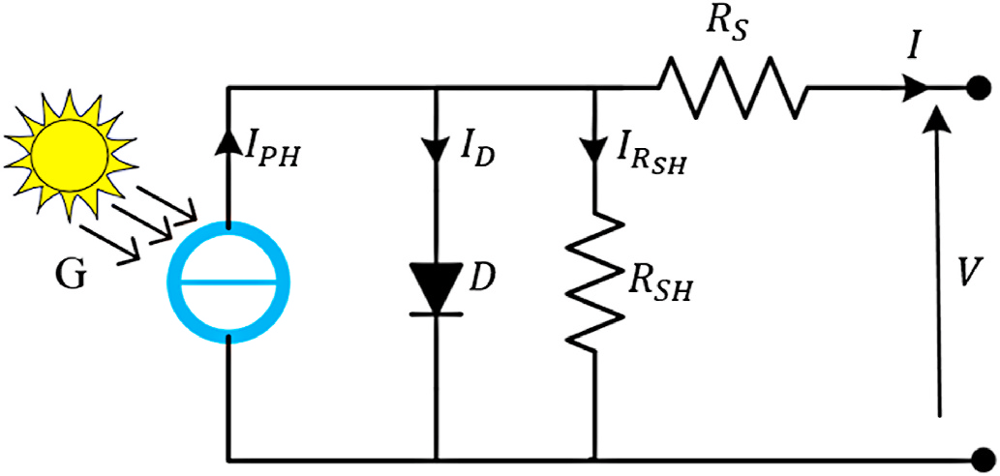

## Trang 4

Journal of Cleaner Production 333 (2022) 130074
4
ID = IO
(
exp q(V + IRS )
αK NST
)
(4) 
The terms of the above equations are defined as:  
• α is the diode ideality factor  
• KV is the voltage temperature coefficient  
• K is the constant of the Boltzmann (1.380653 × 10−23J /K)
• q is the charge of the electron (1.60217646 × 10−19C)
• NS is the number of series cells  
• RS is the series resistance  
• V is the output voltage of the PV panelVOC is the open-circuit voltage 
of the PV panel 
2.3. Shunt-resistor current 
The resistance of the material and the cable links cause certain losses 
in the actual performance of the PV panel (Laudani et al., 2014a, 
2014b). Hence, the series resistor RS and shunt-resistor RSH are applied 
to the mathematical PV model to represent these losses or a voltage drop 
(Lineykin et al., 2014). The RS resistor does not represent the problem of 
the leaked current in the PV circuit model, which is in the range of 
milliohms. As a result, the RSH resistor is considered to introduce the 
effect of this problem, and in general, it is high (Laudani et al., 2014b). 
The shunt-resistor current is considered in the total PV current equation 
to represent the leaked current as follows: Eqs. (5) and (6) (Ciulla et al., 
2014). 
IRSH = (V + IRS)
RSH
(5) 
Therefore, the final total current of the PV panel can be rewritten as, 
I = IPH −IS
(
exp
[(V + IRS)
A T
]
−1
)
−(V + IRS)
RSH
(6)  
where A = α⋅K⋅NS
q
. 
3. PV panel design in Proteus software 
3.1. Extraction of the PV parameters 
In order to build the proposed PV panel, the unknown parameters of 
the PV panel should be extracted. Therefore, in 2016, Mathworks 
released a new version of Matlab/Simulink version 2016, that include a 
PV array tool that allows one to quickly compute the internal unknown 
PV parameters by simply clicking on the PV parameters window. Once 
the manufacturer specifications are entered into this feature, it defines 
and shows the missing parameters as shown in Fig. 2. As discussed supra, 
the proposed model is applied on the SM55 monocrystalline, and the 
KC200GT multi-crystalline PV panels (Siemens Shell Monocrystalline 
Solar Array Datasheet. [Online]. Available:<http://www.atlantasolar. 
com/pdf/Shell/ShellSM55_USv1.pdf, and Kyocera Multi-crystal Photo­
voltaic Modules [Online]. Available:< https://www.energymatters. 
com.au/images/kyocera/KC200GT.pdf). Hence, their datasheet pa­
rameters at STC conditions are listed in Table 1. Also, Table 2 presents 
the extract parameters of these panels. 
3.2. The influence of extracted parameters on the PV characteristics 
The unknown PV parameters RS, RSH, IO,STC, and α for both PV panels 
are estimated at STC conditions using the simple Matlab/PV array tool. 
However, the values of RS, RSH are affected on the I–V panel charac­
teristics, as observed in Fig. 3, decreasing the RSH changes the slope of 
Fig. 2. Model parameters of the SM55 PV panel using PV array tool.  
Table 1 
Datasheet parameters of the SM55 and KC200GT panels at STC conditions.  
Parameters 
KC200GT 
SM55 
PMPP  
200W  
55W  
VMPP  
26.3V  
17.4V  
IMPP  
7.61A  
3.15A  
VOC  
32.9V  
21.7V  
ISC  
8.21A  
3.45A  
KV  
−
0.1230 ​ V/◦C  
−
0.077 ​ V/◦C  
KI  
0.0032 ​ A/◦C  
0.0012A/◦C  
NS  
54 
36   
Table 2 
Extracted PV parameters using Matlab/PV array tool.  
Parameters 
KC200GT 
SM55 
RS  
0.335Ω  
0.528Ω  
RSH  
159.72Ω  
134.64Ω  
IO,STC  
4.1746 × 10−10A  
9.0072 × 10−11A  
α  
1.0015 
0.9645   
S.J. Yaqoob et al.

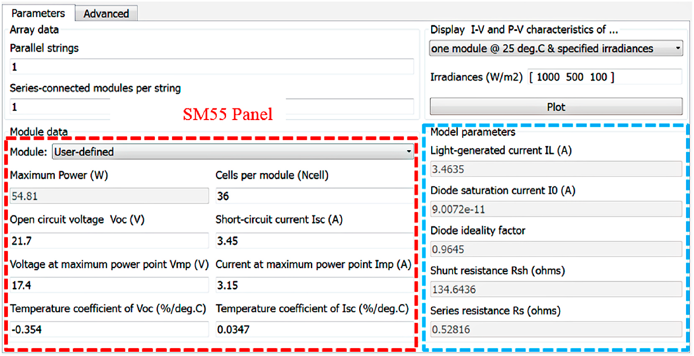

## Trang 5

Journal of Cleaner Production 333 (2022) 130074
5
the I–V characteristics in the upper part of current source region which 
moves till the MPP operating point. Also, an increase in RS affect the 
shape of the I–V graph, especially in the lower section of the voltage 
source area and beyond the MPP. On the other hand, the effect of 
ideality factor of the diode α appears on the “knee” area of the I–V 
characteristic graph as can be observed in Fig. 4. Unfortunately, the 
influence of these parameters can be seen at low irradiance and high- 
temperature values. Even if these parameters are not accurate, their 
impact on the PV curves is minor particularly for high irradiance levels. 
Because the main objective of the proposed paper is to present a new PV 
model in Proteus software, the best extraction method is not discussed 
here. For this reason, future researchers can use other precision methods 
to compute the unknown PV parameters to improve the accuracy of the 
plotted I–V and P–V curves. 
3.3. Execution of the PV panel model in Proteus software 
The theoretical equations of the photo-generated current, the diode 
current, and the shunt-resistor current are modeled using Proteus soft­
ware. In fact, two steps were used to model the PV model, the first one 
involves the extraction of the internal PV panel parameters, and then 
integrating them in Proteus software, the second step is based on the 
modeled Eqs. (2)–(6) by using the component mode in Proteus software 
library as seen in Fig. 5. 
Fig. 3. (a) Series (b) shunt resistance effect on the I–V curve.  
Fig. 4. Effect of diode ideality factor on the I–V characteristic.  
Fig. 5. Schematic diagram of the proposed PV model design in Proteus software.  
S.J. Yaqoob et al.

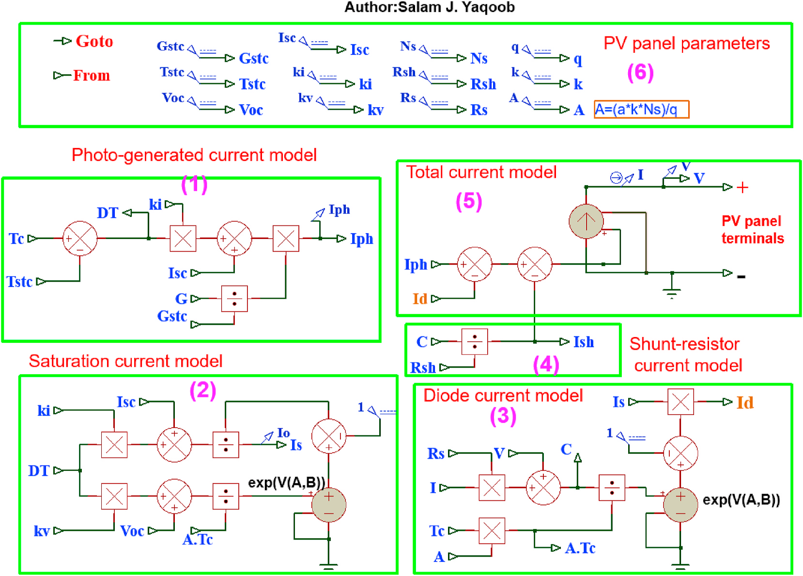

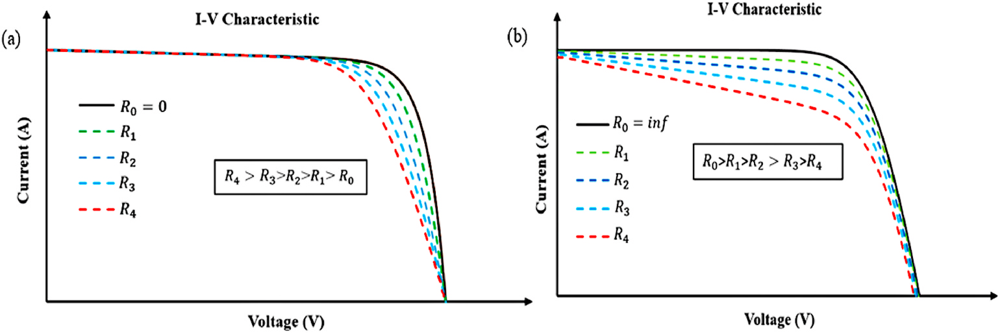

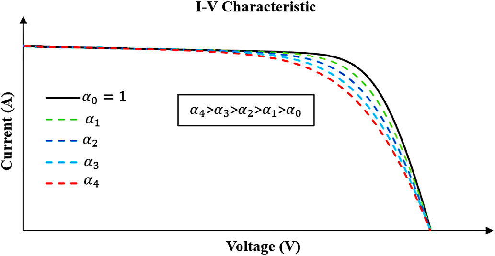

## Trang 6

Journal of Cleaner Production 333 (2022) 130074
6
Hence, this model provides an easy way to any user of the Proteus 
tool to build a PV panel model. Moreover, the proposed flowchart of this 
work is used to clarify the method as shown in Fig. 6. To simplify the 
proposed work, the model in Fig. 5 can be divided into six blocks to 
make it easier to comprehend as follows:  
• Block (1): describes the photo-generated current model.  
• Block (2): describes the saturation diode current model.  
• Block (3): describes the diode current model.  
• Block (4): describes the shunt-resistor current model.  
• Block (5): describes the computation of the total PV current which is 
used as input to the arbitrary voltage controlled current source 
(AVCCS) device.  
• Block (6): describes the datasheet and estimation parameters of the 
PV panel. 
Besides, it is necessary to conduct the following steps in the Proteus 
tool to build a PV model:  
✓ Launch the Proteus software application.  
✓ Open the Schematic Capture.  
✓ Click on Component Mode  
✓ Open the Pick Devices.  
✓ Open “Laplace Primitives". 
✓Select Laplace Addition, Subtraction, Multiplication, Division Oper­
ators, and then add them to your Schematic Capture window.  
✓ Add the Arbitrary Voltage Controlled Voltage Source (AVCVS) and 
AVCCS to the Schematic Capture window by selecting “Modeling 
Primitives".  
✓ Put the datasheet and estimation parameters values of the PV panel, 
and select “DC Generator” to set those values. After that, build the 
mathematical equations of the PV currents and connect your PV 
terminals to a bypass diode and a variable resistive load.  
✓ Use “DC Voltage Source” as a variable load with value “X" for open- 
circuit voltage range of (0 < V > VOC) to show the PV panel voltage 
axis in I–V and P–V curves.  
✓ Use “DC SWEEP ANALYSIS” graph to see the simulation results and 
display the I–V and P–V curves of your PV panel. 
In order to understand the modeling process, the tags for every 
parameter value is used which is presented in Proteus library. Next, a 
sub-circuit in the Proteus is used to simplify and form the PV panel 
model. As a result, a PV model with two inputs of irradiance and panel 
temperature and two output PV terminals of positive and negative signs 
as seen in Fig. 7 is obtained. However, the PV panel characteristics are 
affected by the change of irradiance and temperature. For this reason, 
the physical effect of these values on the P–V and I–V curves are 
investigated in this study. As observed, the photo-generated current 
which is modeled using Eq. (2) has the most effect on the output current 
of the PV panel. Therefore, the amount of this current is affected heavily 
by varying irradiance levels, which then affect the PV characteristics. To 
focus on this effect, the P–V and I–V curves are simulated under different 
irradiance conditions as will be shown in the next simulation results. 
Also, depending on Eq. (3), the diode saturation current is affected by 
changing the degree of the temperature. As a result, the output current 
of the PV panel increases exponentially as the level of temperature rises, 
while the voltage of the PV panel decreases linearly. The effect of 
varying the temperature is utilized also, in section 4. Therefore, this 
model allows the user to test the PV panel’s characteristics under any 
weather condition i.e., irradiance and temperature. 
4. Results and discussion 
To verify the accuracy of the proposed model, both the I–V and P–V 
characteristics of the SM55 monocrystalline, and the KC200GT poly­
crystalline are obtained for different values of irradiance and tempera­
ture. The datasheet and extracted parameters of these panels under STC 
conditions are reported in the Proteus tool to build the model to obtain 
its plotted curves. Additionally, more exhaustive tests have been 
Fig. 6. Proposed model diagram.  
Fig. 7. The PV model sub-circuit.  
S.J. Yaqoob et al.

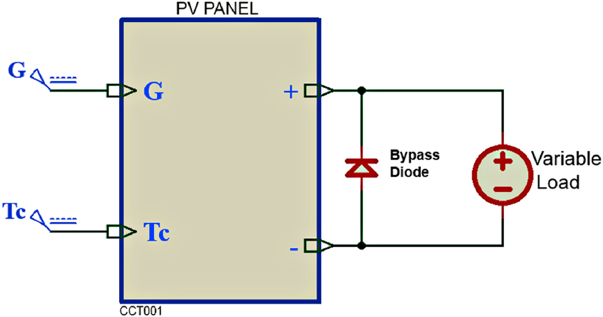

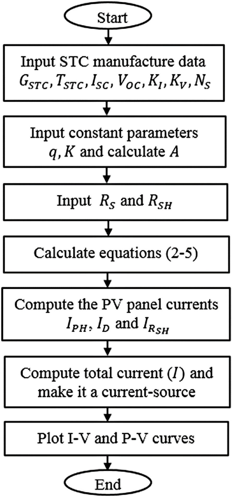

## Trang 7

Journal of Cleaner Production 333 (2022) 130074
7
conducted on the PV modules and then compared with those obtained 
by the manufacturer data, PVsyst software, and literature. Furthermore, 
the discussion is divided into three sections to study the performance 
and accuracy of the proposed model. In the first section, the plotted 
curves of the SM55, and the KC200GT panels are compared with their 
manufacturer data. In the second section, we compared the proposed 
model’s characteristics to those produced by the PVsyst software. On the 
other hand, a comparison of the plotted curves obtained from the 
Fig. 8. (a) I–V (b) P–V curve comparison between the proposed model and manufacturer data at different irradiance values and constant temperature, T = 25◦C for 
SM55 panel. 
Fig. 9. (a) I–V (b) P–V curve comparison between the proposed model and manufacturer data at various temperature values and constant irradiance, G = 1000W/
m2 for SM55 panel. 
Fig. 10. (a) I–V (b) P–V curve comparison between the proposed model and manufacturer data at various levels of irradiance and constant temperature, T = 25◦C for 
KC200GT panel. 
S.J. Yaqoob et al.

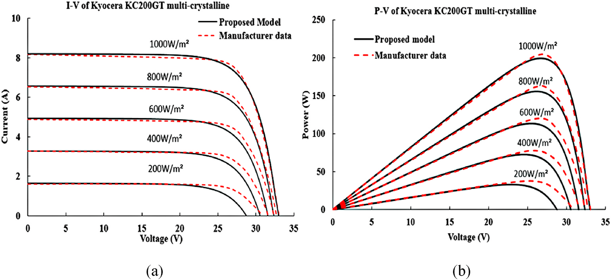

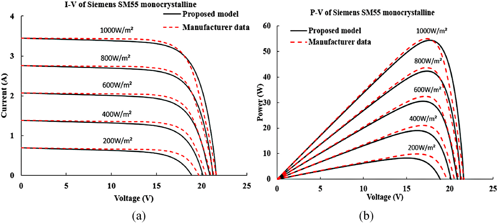

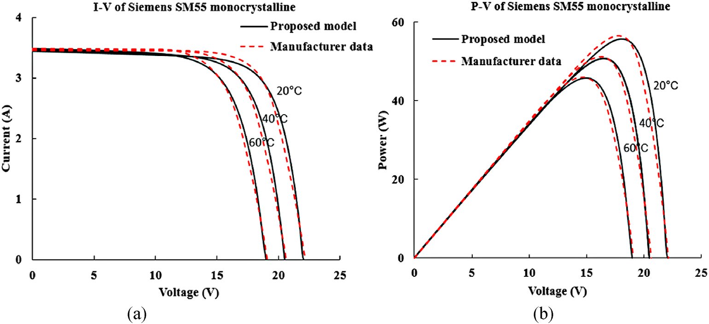

## Trang 8

Journal of Cleaner Production 333 (2022) 130074
8
proposed model and literature results curves are discussed in the third 
section. 
4.1. Comparison with the manufacturer data 
The plotted I–V and P–V curves of the proposed model are compared 
to curves of the manufacturer data under different atmospheric condi­
tions. So, the plotted curves of the SM55 monocrystalline panel for 
various irradiance and constant temperature T = 25◦C are reported in 
Fig. 8. As can be observed, these figures show good agreement between 
the proposed model and manufacturer data with very small difference at 
low irradiance. Also, as demonstrated in Fig. 9, the plotted graphs fits 
well with the one provided by the manufacturer data when temperature 
is varied with constant irradiance G = 1000W/m2. 
Fig. 10 presents a comparison of the I–V and P–V curves for the 
KC200GT multi-crystalline panel between the proposed model and 
Fig. 11. (a) I–V (b) P–V curve comparison between the proposed model and manufacturer data at varying values of temperature and constant irradiance, G =
1000W/m2 for KC200GT panel. 
Fig. 12. (a) I–V (b) P–V graph comparison between the proposed model and PVsyst software for different levels of irradiance and constant temperature, T = 25◦C for 
the SM55 panel. 
Fig. 13. (a) I–V (b) P–V graph comparison between the proposed model and PVsyst software for varying temperature and constant irradiance, G = 1000 W/m2 for 
the SM55 panel. 
S.J. Yaqoob et al.

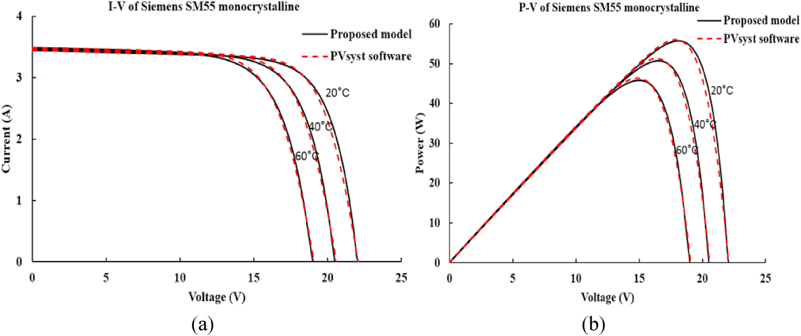

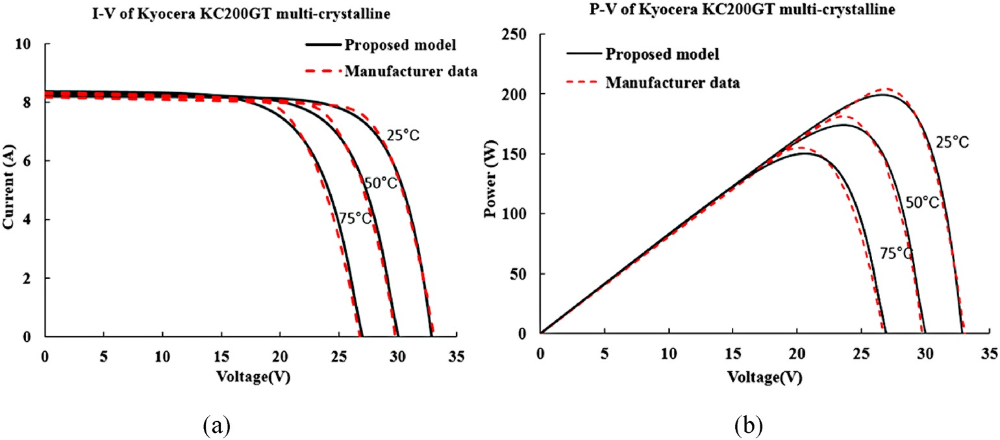

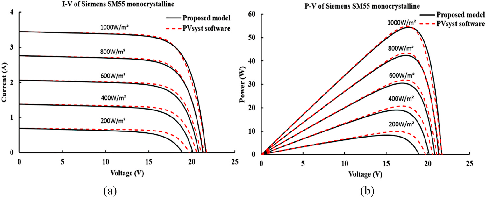

## Trang 9

Journal of Cleaner Production 333 (2022) 130074
9
manufacturer data for different values of irradiance and constant tem­
perature, T = 25◦C. As seen, the plotted figures match with those given 
by manufacturer data for high irradiance levels, whereas only a slight 
disparity can be seen for low irradiance values. Besides, Fig. 11 illustrate 
the proposed model’s curves for the KC200GT panel compared with the 
manufacturer’s curves in case of different temperature values and con­
stant irradiance G = 1000W/m2. 
In summary, from these figures, the performance of the proposed 
model gave acceptable accuracy with negligible errors. Note, the flaw in 
the collected data from the manufacturer is the source of this distur­
bance in the curves. However, the proposed model’s characteristics have 
good performance with a slight discordance around the MPP. 
4.2. Comparison with the PVsyst software 
The database of the PVsyst software is used to compare it with those 
of the proposed graphs to assess the performance of the proposed model. 
Fig. 12 presents the I–V and P–V graphs of the SM55 panel for various 
irradiance values and constant temperature T = 25◦C. As observed, the 
proposed model’s curves for high irradiance levels agree well with those 
given by PVsyst software, whereas for low irradiance levels, only a small 
difference can be seen. 
Fig. 13 show SM55 panel characteristics for different values of 
temperature and fixed irradiance G = 1000W/m2 compared with that of 
the PVsyst software. The proposed model’s characteristics match those 
of the PVsyst with little deviation around the MPP, but this is no 
influence. 
Fig. 14 shows the comparison between the proposed model’s curves 
and that of the PVsyst software for the KC200GT panel for different 
levels of irradiance and constant temperature T = 25◦C. As observed in 
these figures, the proposed model and PVsyst software results have 
identical graphs except for lower irradiance level of G = 200W/m2, at 
this irradiance there is a small discordance around the MPP. Also, the 
proposed model’s curves for the KC200GT are compared with the one 
provided by PVsyst software for different values of temperature and 
fixed irradiance, as presented in Fig. 15. We obtained good performance 
of the proposed model characteristics with very minor deviations 
occurring at T = 75◦C. 
Finally, because the database of those generated by the PVsyst was 
collected based on different unknown PV parameters such as ideality 
constant, series resistor, and shunt resistor they influenced the results. 
Nevertheless, the proposed model shows an acceptable accuracy with 
the PVsyst data under different environmental conditions. 
4.3. Comparison with previously published results 
In order to test the PV panel’s characteristics, a comparison between 
the proposed model and already published works is done. The proposed 
I–V and P–V graphs for both PV panels are compared with models given 
by (Villalva et al., 2009), and (Chalh et al., 2020). 
Fig. 14. (a) I–V (b) P–V graph comparison between the proposed model and PVsyst software curves for different levels of irradiance and constant temperature, T =
25◦C for KC200GT panel. 
Fig. 15. (a) I–V(b) P–V graph comparison between the proposed model and PVsyst software for varying temperature and constant irradiance, G = 1000W/ m2 for 
KC200GT panel. 
S.J. Yaqoob et al.

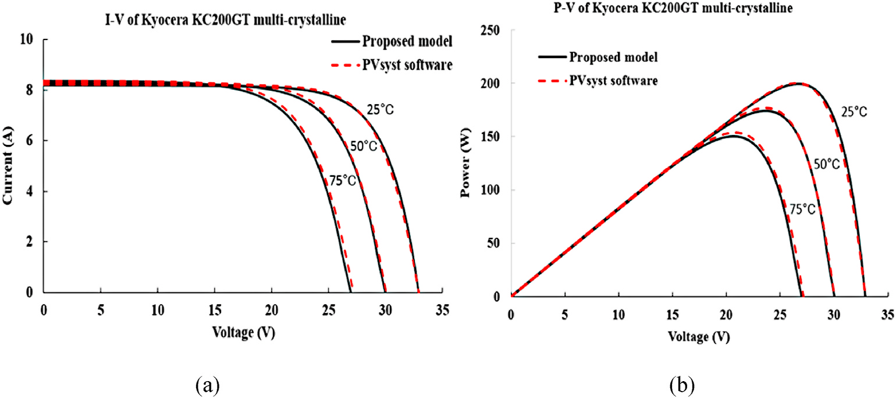

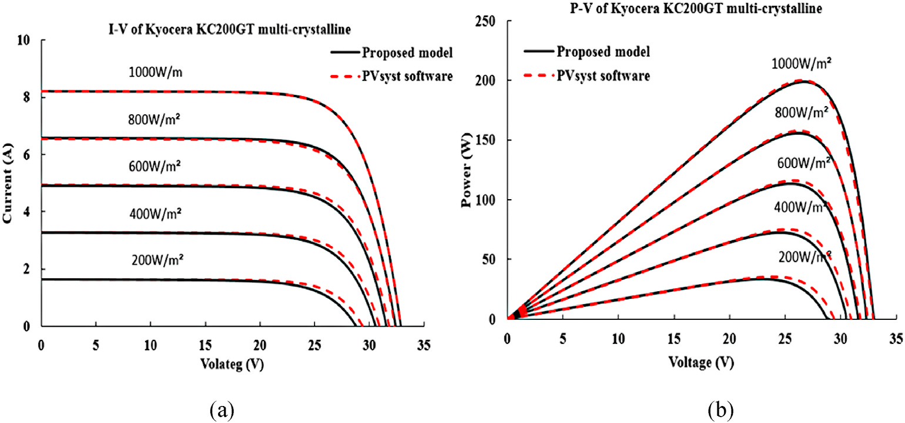

## Trang 10

Journal of Cleaner Production 333 (2022) 130074
10
Fig. 16 illustrate the comparison of SM55 panel curves for different 
levels of irradiance and constant temperature T = 25◦C. It can be seen 
that the proposed model performs well with the results obtained by 
(Villalva et al., 2009) and (Chalh et al., 2020) models. The results of 
(Villalva et al., 2009) and (Chalh et al., 2020) models appear to be 
relatively similar at first glance, but closer inspection reveals minor 
variances, most likely because they used a more accurate unknown 
parameters in the simulation. 
As shown for high irradiance levels of more than 600W/m2, the 
proposed model shows an acceptable performance. In addition, a small 
difference can be seen for irradiance less than 600W/m2. Also, the I–V 
and P–V graphs for temperatures ( T = 20◦C, 40 ◦C, and 60◦C) and for 
G = 1000W/m2 are reported, respectively in Fig. 17. In this figures, we 
compared this study’s data with that of Villalva et al. (2009) model only, 
Fig. 16. (a) I–V (b) P–V graph comparison between the proposed model, Villalva et al. model, and (Chalh et al., 2020) model for different irradiance values and 
constant temperature, T = 25◦C for the SM55 panel. 
Fig. 17. (a) I–V (b) P–V graph comparison between the proposed model, and Villalva et al. (2009) model for varying temperature and fixed irradiance, G = 1000W/
m2 for SM55 panel. 
Fig. 18. (a) I–V (b) P–V graph comparison between the proposed model (Villalva et al., 2009), model, and (Chalh et al., 2020) model for different irradiance values 
and constant temperature, T = 25◦C for the KC200GT panel. 
S.J. Yaqoob et al.

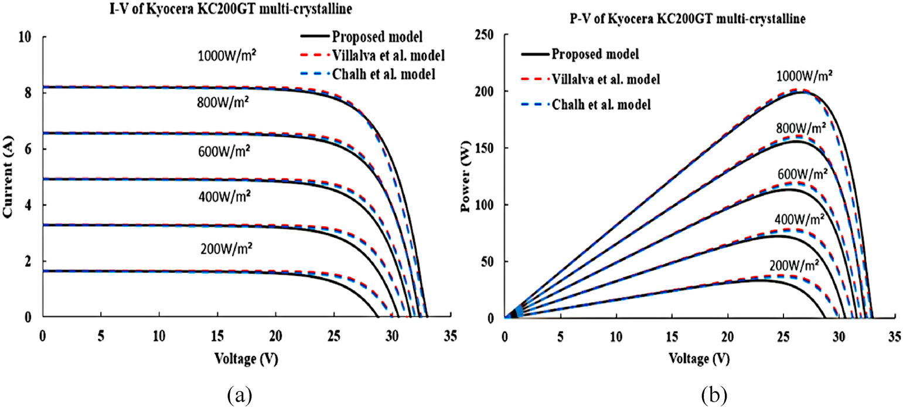

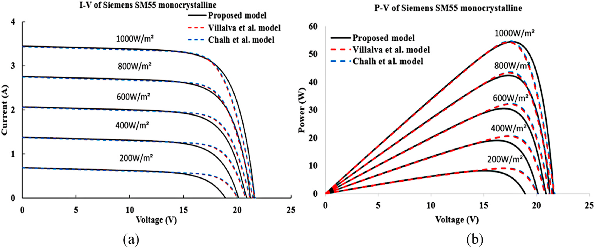

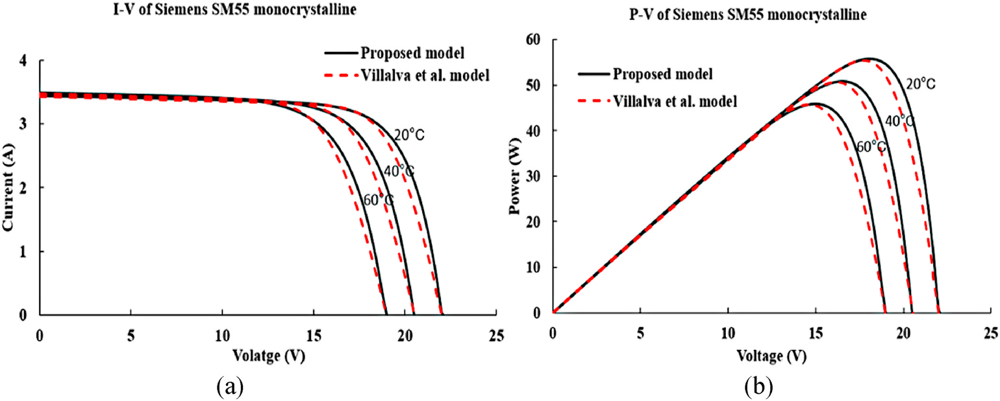

## Trang 11

Journal of Cleaner Production 333 (2022) 130074
11
this is because the Chalh et al. (2020) model fails at any temperature 
value except T = 25◦C. It is for this reason that this model is proposed, 
as demonstrated in the proposed results the plotted curves achieved 
through the proposed model match with those obtained by the Villalva 
et al. (2009) model except for a very small deviations. 
Fig. 18 gives the I–V and P–V comparison between the proposed 
model, Villalva et al. (2009) and Chalh et al. (2020) models for the 
KC200GT panel under various levels of irradiance and fixed temperature 
T = 25◦C. From these figures, the proposed model have good accuracy 
except for lower irradiance level of G = 200W/m2, at this irradiance 
there is a small discordance around the MPP. 
Fig. 19 gives I–V and P–V characteristics for comparison between the 
proposed work and those obtained by Villalva et al. (2009) and Chalh 
et al. (2020) models for temperature ranging from 25◦C to 75◦C and G =
1000W/m2. As seen, the proposed model gives accurate results and 
agrees well with that obtained by Villalva et al. (2009) model. 
Furthermore, in order to assess the accuracy and dispersion of the 
proposed model results, the maximum difference (MD) at MPP for the 
current and power is calculated using the following expressions: 
MD(I) = MAX
[
Ipro,i −Iiss,i
]
(7)  
MD(P) = MAX
[
Vpro,i Ipro,i −Viss,i Iiss,i
]
(8)  
where Ipro,i and Vpro,i are the current and voltage of the i-th point ob­
tained from the proposed model, while Iiss,i and Viss,i are the current and 
voltage of the i-th point obtained from the I–V curves issued by other 
studies. 
Table 3 reports the maximum current differences MD(I)s in I–V 
characteristics of the SM55 panel at different values of irradiance and 
fixed temperature T = 25◦C. As observed, the smallest current differ­
ences are observed for the Villalva et al. (2009) model which seems 
more accurate with respect to the proposed model; the MD(I)s vary from 
−0.11 A to 0.061 A. On the other hand, the highest values of MD(I)s are 
seen for the manufacturer data which are reported from 0.06 A at G =
200W/m2 to 0.121 A at G = 1000W/m2. 
Table 4 presents the MD(I)s results for I–V curves of the SM55 panel 
at different temperatures and constant irradiance G = 1000W/m2. 
Considering I–V curves at different temperatures, the PVsyst software 
shows the smallest MD(I)s values which are contained in the range from 
0.042A to 0.07 A. As seen in this Table, the proposed model succeeded in 
obtaining I–V curves at different temperatures with acceptable accuracy 
Fig. 19. (a) I–V (b) P–V graph comparison between the proposed model and Villalva et al. (2009) model, and (Chalh et al., 2020) model for varying temperature and 
constant irradiance, G = 1000W/m2 for KC200GT panel. 
Table 3 
Differences in current at MPP between the proposed model and the issued I–V 
curves of SM55 panel at different irradiances and fixed temperature T = 25◦C.  
PV parameters at different 
MPP points 
Irradiance (W /m2)
200 
400 
600 
800 
1000 
Manufacturer 
data 
Voltage (V) 
16.20 
17.16 
17.15 
17.10 
17.27 
Current (A) 
0.61 
1.23 
1.89 
2.56 
3.19 
Proposed 
Current (A) 
0.55 
1.175 
1.797 
2.456 
3.069 
Difference 
(A) 
0.06 
0.055 
0.093 
0.104 
0.121 
PVsyst 
software 
Voltage (V) 
16.222 
16.877 
17.20 
17.389 
17.469 
Current (A) 
0.604 
1.227 
1.858 
2.494 
3.138 
Proposed 
Current (A) 
0.55 
1.175 
1.797 
2.456 
3.069 
Difference 
(A) 
0.054 
0.052 
0.061 
0.038 
0.069 
Villalva et al. 
model 
Voltage (V) 
16.85 
17.35 
17.45 
17.45 
17.35 
Current (A) 
0.539 
1.187 
1.838 
2.483 
3.13 
Proposed 
Current (A) 
0.55 
1.175 
1.797 
2.456 
3.069 
Difference 
(A) 
−0.011 
0.012 
0.041 
0.027 
0.061 
Chalh et al. 
model 
Voltage (V) 
17 
17.48 
17.49 
17.5 
17.5 
Current (A) 
0.538 
1.185 
1.84 
2.49 
3.12 
Proposed 
Current (A) 
0.55 
1.175 
1.797 
2.456 
3.069 
Difference 
(A) 
−0.012 
0.01 
0.043 
0.034 
0.051 
The underline values indicates the highest value of MD(I) for each irradiance. 
Table 4 
MD(I)s at MPP between the proposed and the issued I–V graphs of the SM55 
panel at different temperatures and fixed irradiance G = 1000W/m2.  
PV parameters at different MPP points 
Temperature (◦C)
20 
40 
60 
Manufacturer data 
Voltage (V) 
17.60 
16.04 
14.79 
Current (A) 
3.21 
3.19 
3.11 
Proposed Current (A) 
3.095 
3.075 
3.052 
Difference (A) 
0.115 
0.115 
0.058 
PVsyst software 
Voltage (V) 
17.857 
16.34 
14.845 
Current (A) 
3.137 
3.133 
3.122 
Proposed Current (A) 
3.095 
3.075 
3.052 
Difference (A) 
0.042 
0.058 
0.07 
Villalva et al. model 
Voltage (V) 
17.73 
16.16 
14.64 
Current (A) 
3.128 
3.134 
3.126 
Proposed Current (A) 
3.095 
3.075 
3.052 
Difference (A) 
0.033 
0.059 
0.074 
Chalh et al. model 
Voltage (V) 
×
×
×
Current (A) 
×
×
×
Proposed Current (A) 
3.095 
3.075 
3.052 
Difference (A) 
×
×
×
The underline values indicates the highest value of MD(I) for each temperature. 
S.J. Yaqoob et al.

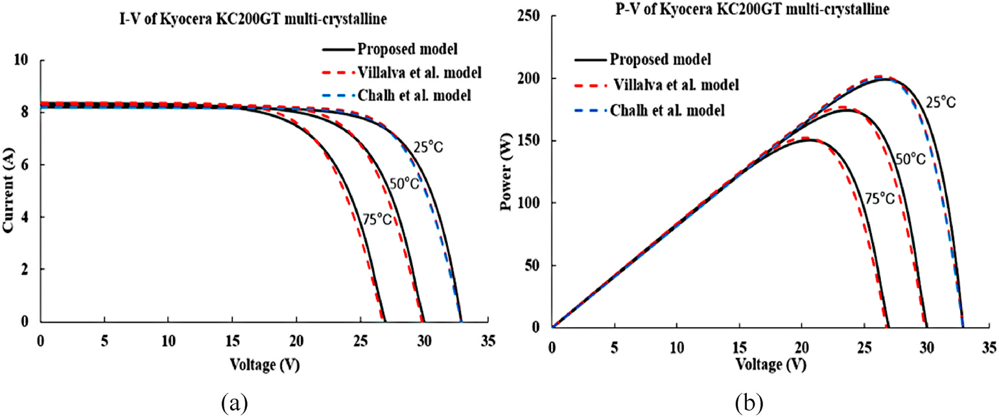

## Trang 12

Journal of Cleaner Production 333 (2022) 130074
12
Table 5 
Differences in power at MPP between the proposed and the issued P–V curves of the SM55 panel at different irradiances and fixed temperature.T = 25◦C  
PV parameters at different MPP points 
Irradiance (W /m2)
200 
400 
600 
800 
1000 
Manufacturer data 
Voltage (V) 
16.20 
17.16 
17.15 
17.10 
17.27 
Power (W) 
9.879 
21.059 
32.445 
43.712 
55.006 
Proposed Power (W) 
8.256 
19.107 
30.554 
42.376 
54.476 
Difference (W) 
1.623 
1.952 
1.891 
1.336 
0.53 
PVsyst software 
Voltage (V) 
16.222 
16.877 
17.20 
17.389 
17.469 
Power (W) 
9.8 
20.718 
31.96 
43.379 
54.82 
Proposed Power (W) 
8.256 
19.107 
30.554 
42.376 
54.476 
Difference (W) 
1.544 
1.611 
1.406 
1.003 
0.344 
Villalva et al. model 
Voltage (V) 
16.85 
17.35 
17.45 
17.45 
17.35 
Power (W) 
9.084 
20.607 
32.078 
43.335 
54.314 
Proposed Power (W) 
8.256 
19.107 
30.554 
42.376 
54.476 
Difference (W) 
0.828 
1.5 
1.524 
0.959 
−0.162 
Chalh et al. model 
Voltage (V) 
17 
17.48 
17.49 
17.5 
17.5 
Power (W) 
9.152 
20.75 
32.284 
43.601 
54.62 
Proposed Power (W) 
8.256 
19.107 
30.554 
42.376 
54.476 
Difference (W) 
0.896 
1.643 
1.73 
1.225 
0.144 
The underline values indicates the highest value of MD(P) for each irradiance. 
Table 6 
Differences in power at MPP between the proposed and the issued P–V curves of 
SM55 panel at different values of temperature and fixed irradiance G =
1000W/m2.   
PV parameters at different MPP points 
Temperature (◦C)
20 
40 
60 
Manufacturer data 
Voltage (V) 
17.60 
16.04 
14.79 
Power (W) 
56.51 
51.127 
45.947 
Proposed Power (W) 
55.715 
50.748 
45.784 
Difference (W) 
0.795 
0.379 
0.163 
PVsyst software 
Voltage (V) 
17.857 
16.34 
14.845 
Power (W) 
56.019 
51.206 
46.349 
Proposed Power (W) 
55.715 
50.748 
45.784 
Difference (W) 
0.304 
0.458 
0.565 
Villalva et al. model 
Voltage (V) 
17.73 
16.16 
14.64 
Power (W) 
55.468 
50.646 
45.769 
Proposed Power (W) 
55.715 
50.748 
45.784 
Difference (W) 
−0.247 
−0.102 
−0.015 
Chalh et al. model 
Voltage (V) 
×
×
×
Power (W) 
×
×
×
Proposed Power (W) 
55.715 
50.748 
45.784 
Difference (W) 
×
×
×
The underline values indicates the highest value of MD(P) for each temperature. 
Table 7 
Differences in current at MPP between the proposed and the issued I–V curves of KC200GT panel at different irradiances and fixed temperature.T = 25◦C   
PV parameters at different MPP points 
Irradiance (W /m2)
200 
400 
600 
800 
1000 
Manufacturer data 
Voltage (V) 
25.34 
25.25 
26.66 
26.74 
26.84 
Current (A) 
1.48 
3.08 
4.51 
6.1 
7.62 
Proposed Current (A) 
1.462 
2.952 
4.437 
5.932 
7.484 
Difference (A) 
0.018 
0.128 
0.073 
0.168 
0.136 
PVsyst software 
Voltage (V) 
23.827 
25.0855 
25.7548 
26.1843 
26.4844 
Current (A) 
1.4956 
3.0056 
4.5211 
6.0402 
7.5605 
Proposed Current (A) 
1.462 
2.952 
4.437 
5.932 
7.484 
Difference (A) 
0.0336 
0.0536 
0.0841 
0.1082 
0.0765 
Villalva et al. model 
Voltage (V) 
24.814 
25.69 
26.083 
26.278 
26.363 
Current (A) 
1.522 
3.056 
4.589 
6.118 
7.6439 
Proposed Current (A) 
1.462 
2.952 
4.437 
5.932 
7.484 
Difference (A) 
0.06 
0.104 
0.152 
0.186 
0.159 
Chalh et al. model 
Voltage (V) 
24.85 
25.55 
25.9 
26.25 
26.25 
Current (A) 
1.468 
3.019 
4.566 
6.071 
7.622 
Proposed Current (A) 
1.462 
2.952 
4.437 
5.932 
7.484 
Difference (A) 
0.006 
0.067 
0.129 
0.139 
0.138 
The underline values indicates the highest value of MD(I) for each irradiance. 
Table 8 
Differences in current at MPP between the proposed and the issued I–V curves of 
KC200GT panel at different values of temperature and fixed irradiance G =
1000W/m2.   
PV parameters at different MPP points 
Temperature (◦C)
25 
50 
75 
Manufacturer data 
Voltage (V) 
26.84 
23.31 
20.06 
Current (A) 
7.62 
7.77 
7.74 
Proposed Current (A) 
7.484 
7.435 
7.287 
Difference (A) 
0.136 
0.335 
0.453 
PVsyst software 
Voltage (V) 
26.484 
23.626 
20.778 
Current (A) 
7.560 
7.500 
7.418 
Proposed Current (A) 
7.484 
7.435 
7.287 
Difference (A) 
0.076 
0.065 
0.130 
Villalva et al. model 
Voltage (V) 
26.363 
23.276 
20.273 
Current (A) 
7.643 
7.597 
7.514 
Proposed Current (A) 
7.484 
7.435 
7.287 
Difference (A) 
0.159 
0.162 
0.227 
Chalh et al. model 
Voltage (V) 
26.25 
×
×
Current (A) 
7.622 
×
×
Proposed Current (A) 
7.484 
7.435 
7.287 
Difference (A) 
0.138 
×
×
The underline values indicates the highest value of MD(I) for each temperature. 
S.J. Yaqoob et al.

## Trang 13

Journal of Cleaner Production 333 (2022) 130074
13
whiles the Chalh et al. (2020) model failed under this test. Moreover, 
from the maximum power differences of the SM55 panel as reported in 
Tables (5 and 6) it is clear that the proposed model shows a good ac­
curacy. As observed, the smallest MD(P)s at fixed temperature and 
varying irradiance are again obtained and compared to the Villalva et al. 
(2009) model that produces MD(P)s varying from −
0.162W at G =
1000W/m2 to 1.524 W at G = 600W/m2. On the other hand, the 
greatest MD(P)s in P–V characteristics at different temperatures are 
generated in the PVsyst software which are contained from 0.458W at 
T = 40◦C to 0.562 W at T = 60◦C. Thus, a little discordance in 
maximum power value exist between the proposed model and the 
PVsyst software. Nevertheless, this small difference in MPP is considered 
not so important because the proposed model has passed the test of a PV 
panel when it is exposed to a sudden change in temperature. 
Table 7 shows the current differences at MPP in I–V graphs of the 
KC200GT panel under different irradiances and constant temperature 
T = 25◦C. As seen in this Table, the greatest MD(I)s result are shown in 
the Villalva et al. (2009) model that yields MD(I)s varying from 0.06A to 
0.186A. With this difference in currents in the proposed and Villalva 
et al. (2009) models, the proposed model presents a good performance 
compared to other models. In addition, the MD(I)s between the proposed 
and the issued I–V characteristics for same panel under different 
temperatures are reported in Table 8. As seen, the Chalh et al. (2020) 
model did not pass through T = 50◦C and 75◦C, because of the fact that 
the Spice code of the diode was created at constant temperature T =
25◦C. Also, we recorded good agreement between the proposed model 
results, PVsyst software, manufacturer data, and the Villalva et al. 
(2009) model, except for high temperatures above 50◦C, in the case of 
manufacturer data this disturbance is caused by the error of the collected 
data. 
Table 9 presents the power differences at MPP in P–V graphs of the 
KC200GT panel for different irradiances and constant temperature T =
25◦C. As present in the Table, the maximum difference in power 
occurred in the case of comparison with the manufacturer data which 
has a yield MD(P) of about 7.38W at G = 800W/m2. 
Table 10 gives the comparison between the proposed and issued P–V 
curves under different temperatures. Moreover, small differences be­
tween the proposed current and other models occurred particularly 
under higher irradiance conditions. It is important to note that the Chalh 
et al. (2020) model was tested under only T = 25◦C. As observed, an 
acceptable MD(P) value of about 1W at G = 100W/m2 is obtained, 
where the proposed model presents a good accuracy when the temper­
ature increased from 25◦C to 75◦C. 
5. Conclusion 
In this paper a new PV panel model is developed and proposed using 
Proteus software tool. A single-diode circuit which consist of a photo- 
generated current, a shunt resistor, and a series resistor is used. First, 
the theoretical analysis of the single-diode circuit is analyzed and then 
the mathematical equations of the photo-generated current, the diode 
current, and the shunt-resistor current are obtained. And thereafter, 
these equations were modeled using the “Laplace Primitives Operators” 
and “Modeling Primitives” tools in “Pick Devices option” of the Proteus 
software library. Second, the unknown internal PV parameters are 
extracted using a PV array tool in Matlab/Simulink. And the effect of 
these parameters on the performance and accuracy of the proposed 
model is considered. 
The performance is tested by comparing the proposed model results 
with manufacturer data, PVsyst tool, and to results in previously pub­
lished works under arbitrary environmental conditions. These compar­
isons have proven that the proposed model has a good accuracy in 
obtaining I–V characteristics. However, the observed slight deviations 
between the proposed model and that of the manufacturer’s data are as a 
result of the flaws in the manufacturer’s data, this accounted for the 
differences in the curves. Therefore, it’s possible to deduce that, the 
proposed model is simple and useable to verify several types of solar PV 
Table 9 
Differences in power at MPP between the proposed and the issued P–V curves of KC200GT panel at different values of irradiance and fixed temperature.T = 25◦C   
PV parameters at different MPP points 
Irradiance (W /m2)
200 
400 
600 
800 
1000 
Manufacturer data 
Voltage (V) 
25.34 
25.25 
26.66 
26.74 
26.84 
Power (W) 
37.503 
77.77 
120.236 
163.114 
204.52 
Proposed Power (W) 
33.264 
72.307 
113.365 
155.731 
199.077 
Difference (W) 
4.239 
5.463 
6.871 
7.383 
5.443 
PVsyst software 
Voltage (V) 
23.827 
25.0855 
25.7548 
26.1843 
26.4844 
Power (W) 
35.635 
75.396 
116.44 
158.158 
200.235 
Proposed Power (W) 
33.264 
72.307 
113.365 
155.731 
199.077 
Difference (W) 
2.371 
3.089 
3.075 
2.427 
1.158 
Villalva et al. model 
Voltage (V) 
24.814 
25.69 
26.083 
26.278 
26.363 
Power (W) 
37.778 
78.532 
119.703 
160.778 
201.518 
Proposed Power (W) 
33.264 
72.307 
113.365 
155.731 
199.077 
Difference (W) 
4.514 
6.225 
6.338 
5.047 
2.441 
Chalh et al. model 
Voltage (V) 
24.85 
25.55 
25.9 
26.25 
26.25 
Power (W) 
36.494 
77.156 
118.265 
159.37 
200.095 
Proposed Power (W) 
33.264 
72.307 
113.365 
155.731 
199.077 
Difference (W) 
3.23 
4.849 
4.9 
3.639 
1.018 
The underline values indicates the highest value of MD(P) for each irradiance. 
Table 10 
Differences in power at MPP between the proposed and the issued P–V curves of 
KC200GT panel at different temperatures and fixed irradiance G = 1000W/ m2.   
PV parameters at different MPP points 
Temperature (◦C)
25 
50 
75 
Manufacturer data 
Voltage (V) 
26.84 
23.31 
20.06 
Power (W) 
204.52 
180.977 
155.1967 
Proposed Power (W) 
199.077 
174.35 
150.49 
Difference (W) 
5.443 
6.627 
4.706 
PVsyst software 
Voltage (V) 
26.484 
23.626 
20.778 
Power (W) 
200.23 
177.22 
154.13 
Proposed Power (W) 
199.077 
174.35 
150.49 
Difference (W) 
1.153 
2.87 
3.64 
Villalva et al. model 
Voltage (V) 
26.363 
23.276 
20.273 
Power (W) 
201.51 
176.83 
152.341 
Proposed Power (W) 
199.077 
174.35 
150.49 
Difference (W) 
2.433 
2.48 
1.851 
Chalh et al. model 
Voltage (V) 
26.25 
×
×
Power (W) 
200.09 
×
×
Proposed Power (W) 
199.077 
174.35 
150.49 
Difference (W) 
1.013 
×
×
The underline values indicates the highest value of MD(P) for each temperature. 
S.J. Yaqoob et al.

## Trang 14

Journal of Cleaner Production 333 (2022) 130074
14
panels. 
This study therefore recommend the following as future research 
areas: (1) study of the partial shading PV condition using Proteus soft­
ware; and (2) Design and simulation of a MPPT algorithm using the 
proposed PV simulator. 
CRediT authorship contribution statement 
Salam J. Yaqoob: Conceptualization, Methodology, Formal anal­
ysis, Writing – original draft, Writing – review & editing, Software, Data 
curation. Saad Motahhir: Conceptualization, Methodology, Formal 
analysis, Writing – original draft, Writing – review & editing, Software, 
Data curation. Ephraim Bonah Agyekum: Formal analysis, Writing – 
original draft, Writing – review & editing. 
Declaration of competing interest 
The authors declare that they have no known competing financial 
interests or personal relationships that could have appeared to influence 
the work reported in this paper. 
References 
Adawi, I., 1964. Theory of the surface photoelectric effect for one and two photons. Phys. 
Rev. 134. A788.  
Agyekum, E.B., 2021. Techno-economic comparative analysis of solar photovoltaic 
power systems with and without storage systems in three different climatic regions. 
Ghana. Sustain. Energy Technol. Assess. 43, 100906. https://doi.org/10.1016/j. 
seta.2020.100906. 
Anani, N., Ibrahim, H., 2020. Adjusting the single-diode model parameters of a 
photovoltaic module with irradiance and temperature. Energies 13, 3226. https:// 
doi.org/10.3390/en13123226. 
Bouraiou, A., Hamouda, M., Chaker, A., Sadok, M., Mostefaoui, M., Lachtar, S., 2015. 
Modeling and simulation of photovoltaic module and array based on one and two 
diode model using Matlab/Simulink. Energy Procedia Int. Conf. Technol. Mater. 
Renew. Energy Environ. Sustain. 74, 864–877. https://doi.org/10.1016/j. 
egypro.2015.07.822. TMREES15.  
Breitenstein, O., 2014. An alternative one-diode model for illuminated solar cells. IEEE J. 
Photovolt. 4, 899–905. https://doi.org/10.1109/JPHOTOV.2014.2309796. 
Chalh, A., El Hammoumi, A., Motahhir, S., El Ghzizal, A., Subramaniam, U., 
Derouich, A., 2020. Trusted simulation using Proteus model for a PV system: test 
case of an improved HC MPPT algorithm. Energies 13, 1943. https://doi.org/ 
10.3390/en13081943. 
Chao, K.-H., Ho, S.-H., Wang, M.-H., 2008. Modeling and fault diagnosis of a 
photovoltaic system. Elec. Power Syst. Res. 78, 97–105. https://doi.org/10.1016/j. 
epsr.2006.12.012. 
Chatterjee, A., Keyhani, A., Kapoor, D., 2011. Identification of photovoltaic source 
models. IEEE Trans. Energy Convers. 26, 883–889. https://doi.org/10.1109/ 
TEC.2011.2159268. 
Chellakhi, A., El Beid, S., Abouelmahjoub, Y., 2021. Implementation of a novel MPPT 
tactic for PV system Applications on MATLAB/Simulink and Proteus-based Arduino 
board environments. Int. J. Photoenergy 1–19. https://doi.org/10.1155/2021/ 
6657627, 2021.  
Ciulla, G., Lo Brano, V., Di Dio, V., Cipriani, G., 2014. A comparison of different one- 
diode models for the representation of I–V characteristic of a PV cell. Renew. 
Sustain. Energy Rev. 32, 684–696. https://doi.org/10.1016/j.rser.2014.01.027. 
de Blas, M.A., Torres, J.L., Prieto, E., Garcı́a, A., 2002. Selecting a suitable model for 
characterizing photovoltaic devices. Renew. Energy 25, 371–380. https://doi.org/ 
10.1016/S0960-1481(01)00056-8. 
De Soto, W., Klein, S.A., Beckman, W.A., 2006. Improvement and validation of a model 
for photovoltaic array performance. Sol. Energy 80, 78–88. https://doi.org/ 
10.1016/j.solener.2005.06.010. 
Ding, K., Bian, X., Liu, H., Peng, T., 2012. A MATLAB-Simulink-based PV module model 
and its application under conditions of nonuniform irradiance. IEEE Trans. Energy 
Convers. 27, 864–872. https://doi.org/10.1109/TEC.2012.2216529. 
El Hammoumi, A., Motahhir, S., Chalh, A., El Ghzizal, A., Derouich, A., 2018. Low-cost 
virtual instrumentation of PV panel characteristics using Excel and Arduino in 
comparison with traditional instrumentation. Renew. Wind Water Sol. 5, 3. https:// 
doi.org/10.1186/s40807-018-0049-0. 
Franzitta, V., Orioli, A., Di Gangi, A., 2016. Assessment of the usability and accuracy of 
the simplified one-diode models for photovoltaic modules. Energies 9, 1019. https:// 
doi.org/10.3390/en9121019. 
Hovinen, A., 1994. Fitting of the solar cell IV-curve to the two diode model. Phys. Scripta 
T54, 175–176. https://doi.org/10.1088/0031-8949/1994/T54/043. 
Hussaian Basha, C., Rani, C., Brisilla, R.M., Odofin, S., 2020. Mathematical design and 
analysis of photovoltaic cell using MATLAB/Simulink. In: Das, K.N., Bansal, J.C., 
Deep, K., Nagar, A.K., Pathipooranam, P., Naidu, R.C. (Eds.), Soft Computing for 
Problem Solving, Advances in Intelligent Systems and Computing. Springer, 
Singapore, pp. 711–726. https://doi.org/10.1007/978-981-15-0035-0_58. 
Kawamura, Hajime, Naka, K., Yonekura, N., Yamanaka, S., Kawamura, Hideaki, 
Ohno, H., Naito, K., 2003. Simulation of I–V characteristics of a PV module with 
shaded PV cells. Sol. Energy Mater. Sol. Cells, PVSEC 12. https://doi.org/10.1016/ 
S0927-0248(02)00134-4. PART III 75, 613–621.  
Keevers, M.J., Green, M.A., 1994. Efficiency improvements of silicon solar cells by the 
impurity photovoltaic effect. J. Appl. Phys. 75, 4022–4031. https://doi.org/ 
10.1063/1.356025. 
Laudani, A., Riganti Fulginei, F., Salvini, A., 2014a. Identification of the one-diode model 
for photovoltaic modules from datasheet values. Sol. Energy 108, 432–446. https:// 
doi.org/10.1016/j.solener.2014.07.024. 
Laudani, A., Riganti Fulginei, F., Salvini, A., 2014b. High performing extraction 
procedure for the one-diode model of a photovoltaic panel from experimental I–V 
curves by using reduced forms. Sol. Energy 103, 316–326. https://doi.org/10.1016/ 
j.solener.2014.02.014. 
Lineykin, S., Averbukh, M., Kuperman, A., 2014. An improved approach to extract the 
single-diode equivalent circuit parameters of a photovoltaic cell/panel. Renew. 
Sustain. Energy Rev. 30, 282–289. https://doi.org/10.1016/j.rser.2013.10.015. 
Lo Brano, V., Orioli, A., Ciulla, G., Di Gangi, A., 2010. An improved five-parameter model 
for photovoltaic modules. Sol. Energy Mater. Sol. Cells Nat. Conf. Emerg. Trends 
Photovoltaic Energy Util. 94, 1358–1370. https://doi.org/10.1016/j. 
solmat.2010.04.003. 
Ma, T., Yang, H., Lu, L., 2014a. Solar photovoltaic system modeling and performance 
prediction. Renew. Sustain. Energy Rev. 36, 304–315. https://doi.org/10.1016/j. 
rser.2014.04.057. 
Ma, T., Yang, H., Lu, L., 2014b. Development of a model to simulate the performance 
characteristics of crystalline silicon photovoltaic modules/strings/arrays. Sol. 
Energy 100, 31–41. https://doi.org/10.1016/j.solener.2013.12.003. 
Mermoud, A., 2012. Pvsyst: Software for the Study and Simulation of Photovoltaic 
Systems. ISE Univ. Geneva. www.pvsyst.com. 
motahhir, saad, Chalh, A., Ghzizal, A.E., Sebti, S., Derouich, A., 2017. Modeling of 
photovoltaic panel by using Proteus. J. Eng. Sci. Technol. Rev. 10, 8–13. https://doi. 
org/10.25103/jestr.102.02. 
Muhammadsharif, F.F., Hashim, S., Hameed, S.S., Ghoshal, S.K., Abdullah, I.K., 
Macdonald, J.E., Yahya, M.Y., 2019. Brent’s algorithm based new computational 
approach for accurate determination of single-diode model parameters to simulate 
solar cells and modules. Sol. Energy 193, 782–798. https://doi.org/10.1016/j. 
solener.2019.09.096. 
Nguyen, X.H., Nguyen, M.P., 2015. Mathematical modeling of photovoltaic cell/module/ 
arrays with tags in Matlab/Simulink. Environ. Syst. Res. 4, 24. https://doi.org/ 
10.1186/s40068-015-0047-9. 
Saleh, A.L., Obed, A.A., Hassoun, Z.A., Yaqoob, S.J., 2020. Modeling and simulation of A 
low cost Perturb& observe and incremental conductance MPPT techniques in 
Proteus software based on flyback converter. IOP Conf. Ser. Mater. Sci. Eng. 881, 
012152 https://doi.org/10.1088/1757-899X/881/1/012152. 
Salman, A., Williams, A., Amjad, H., Bhatti, M.K.L., Saad, M., 2015. Simplified modeling 
of a PV panel by using PSIM and its comparison with laboratory test results. In: IEEE 
Global Humanitarian Technology Conference (GHTC). Presented at the 2015 IEEE 
Global Humanitarian Technology Conference (GHTC), pp. 360–364. https://doi.org/ 
10.1109/GHTC.2015.7343997, 2015.  
Singhal, A.K., Narvey, R., Gwalior, S., 2011. PSIM and MATLAB based simulation of PV 
array for enhance the performance by using MPPT algorithm. Int. J. Electr. Eng. IEEE 
4, 511–520. 
Villalva, M.G., Gazoli, J.R., Filho, E.R., 2009. Comprehensive approach to modeling and 
simulation of photovoltaic arrays. IEEE Trans. Power Electron. 24, 1198–1208. 
https://doi.org/10.1109/TPEL.2009.2013862. 
Volker, Q., 2005. Understanding Renewable Energy Systems. Earthscan Kan. 
Walker, G., 2001. Evaluating MPPT converter topologies using a Matlab PV model. 
J. Electr. Electron. Eng. Aust. 21, 49–55. 
Yahya-Khotbehsara, A., Shahhoseini, A., 2018. A fast modeling of the double-diode 
model for PV modules using combined analytical and numerical approach. Sol. 
Energy 162, 403–409. https://doi.org/10.1016/j.solener.2018.01.047. 
Yan, C., Wen, Y., Jinzhao, L., Jingjing, B., 2011. PROTEUS-based simulation platform to 
study the photovoltaic cell model under partially shaded conditions. In: 2011 
International Conference on Electric Information and Control Engineering. Presented 
at the 2011 International Conference on Electric Information and Control 
Engineering, pp. 3446–3449. https://doi.org/10.1109/ICEICE.2011.5778259. 
Yaqoob, S.J., Obed, A.A., 2019. Modeling, simulation and implementation of PV system 
by Proteus based on two-diode model. J. Technol. 1, 39–51. https://doi.org/ 
10.51173/jt.v1i1.43. 
Yaqoob, S.J., Saleh, A.L., Motahhir, S., Agyekum, E.B., Nayyar, A., Qureshi, B., 2021. 
Comparative study with practical validation of photovoltaic monocrystalline module 
for single and double diode models. Sci. Rep. 11, 19153. https://doi.org/10.1038/ 
s41598-021-98593-6. 
S.J. Yaqoob et al.
