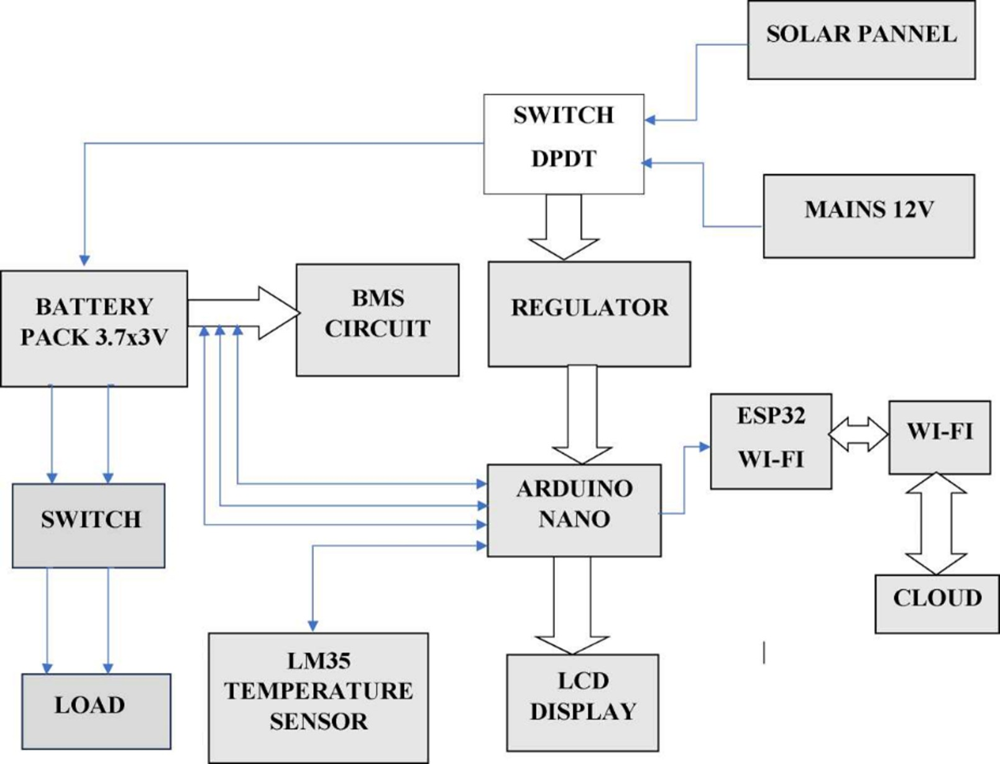
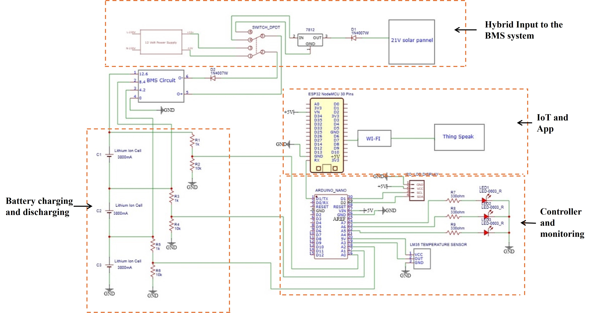
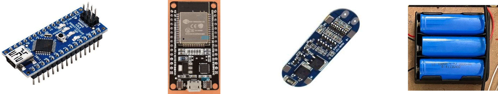
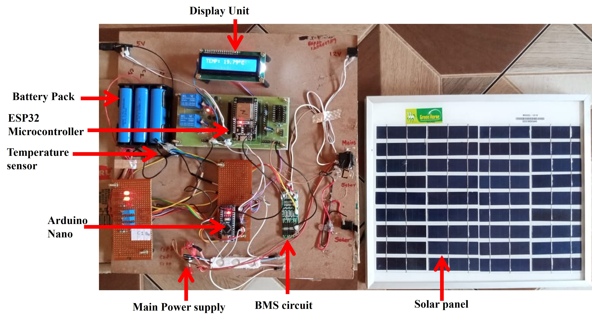
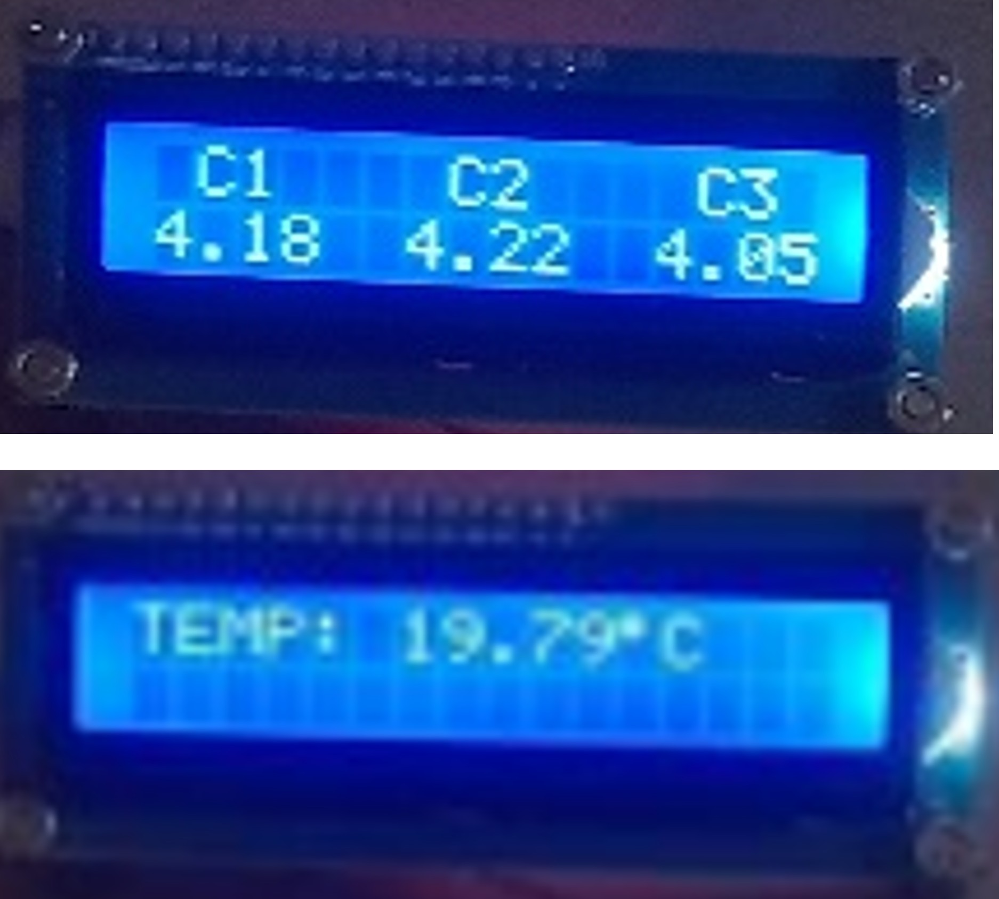
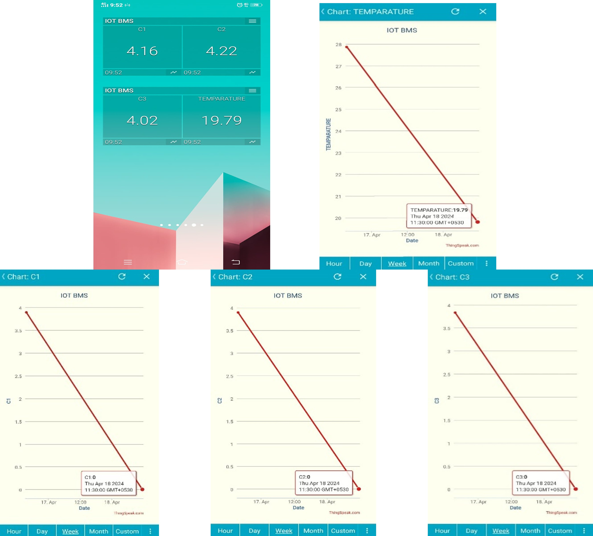
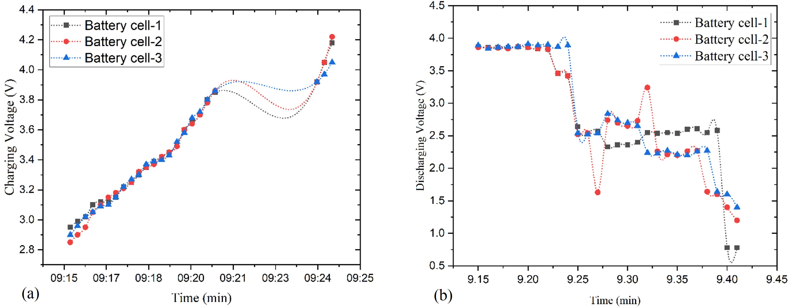
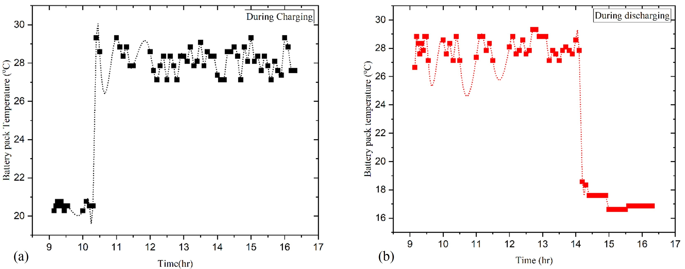

# Ref 2 - Hybrid BMS using IoT (Kulkarni et al., 2025)
> Raw extract từ `Hybrid battery management system using the internet of_things.pdf` (PyMuPDF). Text + ảnh gốc, chưa chỉnh sửa.
> Số trang: 8

---

## Trang 1

Volume 19, Issue 2, 192531 (1-8)
Majlesi Journal of Electrical Engineering (MJEE)
https://doi.org/10.57647/j.mjee.2025.1902.31
Hybrid battery management system using the internet of
things
Prasad Kulkarni1,2
, Lakshmanrao S. Paragond1
, Shivashankar Hiremath3,∗
1Department of Electrical and Electronics, Manipal Institute of Technology, Manipal Academy of Higher Education,
Manipal, Karnataka, India.
2Department of Electrical Engineering, Kolhapur Institute of Technology’s College of Engineering (Autonomous), Kolhapur,
Maharashtra, India.
3Department of Mechatronics, Manipal Institute of Technology, Manipal Academy of Higher Education, Manipal, Kar-
nataka, India.
∗Corresponding author: ss.hiremath@manipal.edu
Original Research
Received:
21 December 2024
Revised:
5 March 2025
Accepted:
15 March 2025
Published online:
1 June 2025
© 2025 The Author(s). Published by
the OICC Press under the terms of
the Creative Commons Attribution
License, which permits use, distribu-
tion and reproduction in any medium,
provided the original work is prop-
erly cited.
Abstract:
The steadily increasing acceptance of battery technology has created numerous opportunities for identifying
new technologies and methods to improve the performance and safety of batteries used in various applications,
including electric vehicles and digital devices. The current study focuses on the interaction of hardware and
software for recording and monitoring battery pack data. The battery management system uses IoT technology,
a microcontroller, and sensors to collect voltage and temperature data from battery cells. The individual cell
voltage reached approximately 4.2 volts and achieved a full charge of 99%, which was measured locally
and displayed remotely on a mobile dashboard via an IoT server. The cells are charged in parallel, and the
entire charging process for all cells is completed in about 10 minutes. The battery pack temperature was
continuously monitored during charging and discharging, assisting in mitigating risks and improving battery
lifespan through proper data. The battery management system’s ability to monitor charging and discharging
cycles and their performance allows for corrective actions and informed decision-making to ensure safe
operation. Validation, testing, and demonstration of the effectiveness of the IoT-based hybrid-powered battery
management system revealed its ability to detect battery performance issues and exchange data for disciplinary
action. This creates a safe environment for the use of battery management systems in a variety of battery
operations.
Keywords: Battery cell; Internet of things; Hybrid system; Battery management; Microcontroller
1. Introduction
In the current era, power management is crucial across all
industrial sectors, including automotive, medical, and man-
ufacturing [1, 2]. The increasing development and adop-
tion of electric vehicles (EVs) have highlighted numerous
challenges related to battery performance and safety [3].
Effective battery management is essential to address these
issues, ensuring safety and extending the lifespan of batter-
ies or battery packs [4]. Thus, battery management systems
(BMS) play a vital role in maintaining the balance of charg-
ing and discharging cycles by leveraging prior experience,
historical data, and advanced modeling techniques [5, 6].
Lithium-ion cells, commonly used in battery packs, are as-
sembled into modules and connected in series to provide
the required voltage for various applications [7]. The volt-
age and temperature of these batteries must be kept within
specific ranges to ensure safe operation. Deviation from
these ranges can lead to battery cell degradation or igni-
tion. Typically, the voltage of a Lithium-ion battery cell
should remain between 2.5 to 4.2 volts, and the temperature
should be maintained between 40 °C and 60 °C to ensure
safe operation [8, 9]. Several factors can affect battery cells,
including cell age, overcharging, over-discharging, and load
complexity [10]. Modern BMS must ensure battery packs
function safely and report their status regularly. BMS can
significantly extend battery cell life by monitoring the state
of charge (SoC). Accessing real-time information on battery
charging and discharging status enhances the safety and
durability of battery cells [11].
Further, hybrid battery charging systems that integrate so-
lar power with main power sources offer a robust solution

## Trang 2

2/8
MJEE19 (2025) -192531
Kulkarni et al.
for maintaining reliable energy storage and supply [12, 13].
These systems combine renewable energy from solar pan-
els with the dependable availability of main power sources,
ensuring continuous power availability while optimizing
battery performance and energy efficiency. During sunny
periods, solar panels generate electricity, which is regulated
by a charge controller and used to charge the battery bank.
The charge controller ensures efficient and safe charging.
When solar power is insufficient, such as during nighttime
or cloudy days, the system automatically switches to the
main power source to charge the batteries, ensuring a reli-
able power supply. Additionally, the inverter draws power
from the battery bank to supply power to connected loads.
The system can seamlessly transition between solar and
main power sources to maintain an uninterrupted power
supply.
A sophisticated monitoring system provides real-time data
on energy production, consumption, and battery status, al-
lowing for informed decision-making and system optimiza-
tion [14, 15]. Effective battery management strategies fur-
ther enhance system performance, making hybrid systems
increasingly attractive for residential, commercial, and re-
mote applications [16]. The integration of the Internet of
Things (IoT) in battery management systems represents a
significant advancement in optimizing battery performance,
enhancing efficiency, and ensuring reliability [17, 18]. IoT-
enabled BMS can monitor, control, and manage battery
operations in real-time, leading to extended battery life, and
enhanced safety. IoT is an advanced technology used across
various fields today [19]. It involves the interconnection of
physical components, embedded electronics, sensors, actua-
tors, and network connections, allowing these components
to gather and share data. IoT devices link physical compo-
nents to the virtual world, enabling data access from any
location. Using IoT systems, battery operations can be eas-
ily monitored and controlled remotely. Leveraging real-time
data, predictive analytics, and remote management capabili-
ties, IoT enhances the efficiency, reliability, and lifespan of
battery systems across various applications [20, 21]. The
integration of IoT in battery management not only improves
operational efficiency but also contributes to broader goals
of energy conservation and sustainability.
The main objective of the present work is to develop a
hybrid battery management system using the Internet of
Things. This approach aims to provide an efficient way
to monitor battery parameters and improve battery durabil-
ity. Regular monitoring of battery health parameters, such
as voltage and temperature, can significantly boost battery
performance. A microcontroller unit with a built-in Wi-Fi
function is used to collect data and transmit it to the server.
A display unit connected to the BMS monitors the current
status of the sensors. A mobile application is developed to
remotely monitor the current status of battery cells. Thus,
the IoT-based BMS is being developed with the long-term
goal of improving cost-effectiveness, safety, reliability, and
optimal operation of battery energy storage systems.
2. Methodology
The proposed schematic diagram of the BMS model is pre-
sented in figure 1. It comprises photovoltaic solar panels, a
main power source, a BMS system, a controller unit, and
an IoT interface system. The solar panel generates a direct
Figure 1. Schematic of battery management system.
2345-3796[https://doi.org/10.57647/j.mjee.2025.1902.31]

## Trang 3

Kulkarni et al.
MJEE19 (2025) -192531
3/8
voltage in the presence of sunlight, which is transmitted
to charge the battery through a switch. When sunlight is
insufficient, the main power source is available to charge
the battery pack. The energy generated by the solar panel
is stored in the battery pack and used as needed. The pri-
mary function of the battery management system is to detect
and monitor the battery type, voltage, temperature, power
consumption, state of charge, and charging cycle. The dedi-
cated interface among the components provides real-time
information to the end user regarding the status of the bat-
tery. To ensure safe operation, the BMS monitors factors
such as temperature and voltage across the battery pack. It
also tracks the state of health of the battery, indicating its
charging and discharging status. Additionally, the BMS
continuously monitors the temperature and manages the
thermal effects on the battery pack. It measures the overall
battery pack temperature and can activate the cooling sys-
tem if the temperature exceeds a certain threshold, ensuring
it remains within safe limits. An additional provision for
thermal management has been integrated into the BMS unit.
The BMS unit is connected to the central controller unit and
the battery cells to facilitate continuous data exchange. It
transmits battery parameters to the controller unit, enabling
easy monitoring of the system’s loading capability. The
controller unit acts as the main interface between the BMS
and IoT devices, exchanging data with the end user through
the server. With this data, corrective actions can be taken
to maintain optimal battery parameters, preventing issues
such as overheating and leakage, and ensuring the safety of
the battery cells. In battery technology, the rate at which a
battery is charged or discharged about its nominal capacity
is referred to as the “C-rate.” It represents a multiple of the
battery’s rated capacity and determines the current flowing
into or out of the battery. It can be expressed mathematically
as:
I = C ×Capacity
(1)
where ‘I’ is the current, C is the C-rate, and Capacity is the
nominal capacity of the battery.
2.1 Simulation and hardware
The schematic circuit of the battery management and con-
trolling unit is shown in figure 2. The circuit is implemented
using proteus software to represent the working of a realistic
BMS circuit and control unit. The BMS model incorporates
all the electronic components, including the BMS circuit,
controller unit, battery cell, temperature sensor, and Wi-Fi
module. The battery specifications have been used in the
present work such as Battery Type: Lithium-Ion Battery,
Nominal Voltage: 3.7 V, Nominal Capacity: 2000 mAh, An-
ode Material: Graphite, Cathode Material: Lithium Cobalt
Oxide (LiCoO2), Electrolyte Material: Lithium salt dis-
solved in organic solvent. However, the IoT integration
was implemented with the circuit to show interfacing with
IoT components with the circuit diagram. The solar panel
and main power source were connected to a double pole
double throw switch based on the condition that the supply
unit can be switched over and transmit voltage to the BMS
circuit. The battery pack is charged through the BMS circuit
as required by individual battery cells. Then, the battery
voltages were gathered by the controller unit, and the same
voltage status was displayed on the screen. Temperature
sensors were used continuously to monitor the temperature
of the battery pack. When the temperature of the battery
exceeds the limit set in the controller unit, a cooling system
can be switched on to avoid the overheating of the battery
cell. The display unit in the circuit shows the individual
battery cell voltage status and temperature of the battery
pack. All sensing unit data is transmitted to the Arduino
uno controller unit. Then the controller-recorded data is
Figure 2. Schematic circuit of the BMS.
2345-3796[https://doi.org/10.57647/j.mjee.2025.1902.31]

## Trang 4

4/8
MJEE19 (2025) -192531
Kulkarni et al.
transmitted to ESP 32 through a Wi-Fi module using a se-
rial connection. IoT cloud server is utilized to check the
battery status remotely in their smartphone or computer.
The hardware components used to implement the exper-
imental setup for battery data management included an
Arduino Nano, ESP32, 12.6 V lithium-ion battery pack
(with each cell having 4.2 volts), DPDT switch, 16x2 LCD,
LM35 temperature sensor, and a 12 V solar panel. The
main components of the battery management system are
shown in figure 3. A voltage divider and BMS circuit were
implemented to exchange the current and voltage values of
the BMS system. Initially, the battery pack is charged by
both the solar panel and the main power supply system, con-
trolled via a double-pole switch. A hybrid energy system
integrates multiple energy sources (e.g., solar, and batteries)
to optimize energy generation, storage, and usage. On the
other hand, a single-battery energy system relies solely on
a single energy storage unit for its operations. In the cur-
rent study, while the focus was primarily on monitoring the
battery’s SOC and temperature, the parameters of the solar
energy system, such as solar panel output voltage and cur-
rent, were also considered during the design and operation
of the hybrid system. The LM35 temperature sensor is con-
nected to the battery pack and the Arduino Nano controller.
The controller converts the analog data of the voltage and
temperature, and the individual cell voltages and battery
temperature are displayed on the LCD screen. An I2C mod-
ule was used to interface the controller unit with the display
system. The sensor data is collected and transmitted to the
Arduino Nano controller unit. The collected data is then
transmitted to the ESP32 via the Wi-Fi module and subse-
quently to the Thing Speak server. The Arduino Nano Tx
pin is connected to the ESP32 Rx pin, allowing the battery
parameters to be displayed on the Thing Speak server. The
Thing Speak server shows graphs of individual cell charging
and discharging patterns using real-time data monitoring.
To ensure a secure connection when transferring data be-
tween the ESP32 and the server, a unique authorization
token is used, which is defined when registering an account
on the Thing Speak mobile application. The data received
from the server is shown on the digital dashboard.
3. Results and discussion
Battery management using a hybrid power supply and the
Internet of Things has been implemented with various hard-
ware and software components. The working prototype
of the proposed battery management system is shown in
figure 4. The hardware components were assembled after
individually testing each part. Code was written to read
sensor data, and a regulated circuit was used to control the
switching device. The BMS system is powered by the main
power source and a USB port connected to the controller
Figure 3. Main hardware component (a) Arduino Nano (b) ESP32 Microcontroller (c) BMS circuit (d) Li-ion Battery Pack.
Figure 4. Working prototype of the battery management system.
2345-3796[https://doi.org/10.57647/j.mjee.2025.1902.31]

## Trang 5

Kulkarni et al.
MJEE19 (2025) -192531
5/8
and Wi-Fi module. Data collected from the controller and
ESP32 is processed and linked to the Thing Speak server.
Cell voltage and temperature are displayed on a mobile app
and locally on an LCD screen. This data is continuously
updated in real-time on the dashboard.
The battery information, including each cell’s voltage and
temperature, was continuously recorded and displayed. The
BMS sensor data is displayed on an LCD, as shown in fig-
ure 5. The actual voltage of each cell was measured using a
voltage sensor connected to each battery. The voltage sensor
synchronized with the battery cell to measure the transition
voltage. Similarly, a temperature sensor was connected to
the battery, continuously monitoring the temperature and
aiding in thermal management. This displayed data pro-
vides crucial battery information directly near the battery
pack system.
Figure 5. BMS data were displayed on an LCD screen.
Table 1 shows the measured voltage of each battery cell as
well as the system’s difference in error during calibration.
The voltage sensor detects the continuous voltage of the bat-
tery cell, and a multi-meter is used to verify the cell voltage
before connecting the system. There was a percentage error
in the voltage of individual cells. This error is an obvious
phenomenon that occurs in all battery systems. As a result,
proper calibration prevents fluctuation in the cells, and dras-
tic voltage changes can shorten battery life.
The dashboard was meticulously designed to display all
BMS information remotely, providing users with compre-
hensive and real-time insights into the battery’s performance
and condition. As depicted in figure 6, the mobile applica-
tion dashboard allows users to view the voltage and tem-
perature of each battery cell. The application effectively
monitors the battery’s condition as reported by the BMS
model. Users can observe both the graphical and numerical
representations of individual battery cell voltages and the
overall temperature of the battery pack. This dual-format
presentation ensures that users can quickly understand the
battery’s status, whether they prefer visual graphs or pre-
cise numerical data. The successful integration of the IoT
with the BMS system exemplifies its deployment ability
for end-user applications. The IoT interfacing allows for
continuous monitoring and data transmission, ensuring that
users are always informed about the battery’s health and
performance. This real-time information can be crucial for
making informed decisions regarding the battery’s usage,
maintenance, and safety. In essence, the mobile application
dashboard not only enhances the usability and accessibility
of the BMS information but also represents a significant
step towards more efficient and user-friendly battery man-
agement solutions.
Furthermore, the battery charging voltage levels of individ-
ual battery cells were continuously monitored and recorded.
The server, via the IoT module, was able to read the charg-
ing voltages, as illustrated in figure 7. When the main power
is turned on, each battery cell charges from its default volt-
age to a maximum of approximately 4.2 volts, achieving a
full charge of 99%. The cells are charged in parallel, and the
entire charging process for all cells is completed in about
10 minutes, as shown in figure 7 (a).
Similarly, when the load is activated, the discharging op-
eration begins. The capacity of the battery cells decreases,
meaning the voltage levels drop according to the load, as
depicted in figure 7 (b). To ensure safe operation, the BMS
unit sets limits for both the charging and discharging of
the battery cells. An interlocking system ensures that dur-
ing the charging process, discharging is disabled to prevent
cell degradation and ensure safety. Furthermore, the sys-
tem is designed to disconnect the battery cells from the
charging supply once they are fully charged. During dis-
charge, indications and precautions are provided to ensure
that appropriate actions are taken by the user. The BMS
also incorporates indicators for discharging levels, which
prompt users to take necessary actions. The system’s design
includes future aspects such as monitoring the time taken
for charging and discharging, understanding parameters that
influence battery degradation, and other conditions that can
help improve battery life and performance. By continuously
gathering data on charging and discharging operations, the
BMS can provide insights into the efficiency and health of
the battery cells. This information is crucial for enhancing
the overall performance and longevity of the batteries, mak-
ing the BMS a vital tool for battery management.
Table 1. Battery cell voltage measurement.
Cell No
Battery cell voltage (V)
Multi-meter measurement (V)
Percentage error (%)
C1
4.18
4.00
4.50
C2
4.22
4.10
2.92
C3
4.05
3.99
1.50
2345-3796[https://doi.org/10.57647/j.mjee.2025.1902.31]

## Trang 6

6/8
MJEE19 (2025) -192531
Kulkarni et al.
Figure 6. Battery status monitoring in the mobile dashboard.
In addition, temperature is a critical parameter in the BMS
system. Overcharging or exposure to external heat can cause
the battery to overheat, potentially leading to dangerous sit-
uations. Therefore, consistent temperature monitoring of
battery cells is essential in any electrical battery system.
During both the charging and discharging processes, the
temperature of the battery cells is continuously monitored.
Figure 8 illustrates the temperature variations of the battery
pack during charging and discharging. It was observed that
there is typically a fluctuation of about 7 °C to 8 °C during
these processes. Overcharging or leaks in the battery cells
can result in even higher temperatures, posing significant
safety risks. To mitigate these risks, cooling systems are
sometimes implemented to maintain optimal temperatures
and prevent overheating. This consistent temperature moni-
toring ensures the safe operation of the battery system. High
Figure 7. IoT server gathers the individual battery cell voltage during (a) Charging and (b) Discharging of the battery.
2345-3796[https://doi.org/10.57647/j.mjee.2025.1902.31]

## Trang 7

Kulkarni et al.
MJEE19 (2025) -192531
7/8
Figure 8. The server records the battery temperature during (a) Charging and (b) Discharging of battery voltage.
temperatures can compromise the integrity and safety of the
battery, making it unsafe for further operation. Therefore,
the inclusion of a cooling system in the BMS helps man-
age and dissipate excess heat, maintaining the temperature
within safe limits.
The BMS thus plays a crucial role in all battery-operated
systems by ensuring that temperature fluctuations are kept
in check. This not only enhances the safety of the system
but also extends the lifespan of the battery cells by prevent-
ing thermal degradation. The importance of a robust BMS
cannot be overstated, as it safeguards the system against
potential failures and hazards associated with temperature
extremes.
4. Conclusion
The present study successfully implemented a battery man-
agement system utilizing the IoT to monitor and manage
various parameters of a battery pack. The system employed
a hybrid power source to support the BMS components and
analyzed battery cells connected to the IoT device. Contin-
uous monitoring of the cell voltage and temperature was
achieved, with data displayed both locally and remotely.
The integration of hardware and software facilitated effec-
tive data exchange and real-time monitoring of the battery
cells. A dashboard was created to remotely access cell volt-
age and temperature, aiding in the comprehensive health
monitoring of the battery cell. The individual battery cells,
C1, C2, and C3, measured voltages of 4.18 V, 4.22 V, and
4.05 V, respectively. The overall measurement efficiency
achieved was 99%. Further, the study observed that the
charging time of the battery was shorter than the discharg-
ing time. Additionally, a noticeable temperature rise was
observed during the charging phase, followed by a decrease
during discharging. A temperature variation of 7 °C to
8 °C was recorded during prototype testing. The use of
IoT technology proved beneficial for precise and remote
access to individual battery data without information loss.
This approach to BMS not only enhanced the protection of
the battery cells but also ensured the safety of the overall
system.
Acknowledgment
The author would like to thank the Department of Electrical
Engineering at Kolhapur Institute of Technology’s College
of Engineering for providing the necessary facilities to carry
out the work.
Nomenclature
IoT
Internet of things
LCD
Liquid crystal display
OCV
Open circuit voltage
SOC
State of Charge
HEV
Hybrid Electric Vehicle
EV
Electric vehicle
BMS
Battery management sys-
tem
BTMS
Battery thermal manage-
ment system
DPDT
Double
pole
double
through
ECM
Equivalent Circuit Model
ESP32
Espressif Systems 32-bit
Wi-Fi
Wireless fidelity
I2C
Inter-Integrated Circuit
LIB
Lithium-Ion Battery
2345-3796[https://doi.org/10.57647/j.mjee.2025.1902.31]

## Trang 8

8/8
MJEE19 (2025) -192531
Kulkarni et al.
Authors contributions
Authors have contributed equally in preparing and writing the
manuscript.
Availability of data and materials
Data sharing does not apply to this article as no such datasets were
generated or analyzed during the current study.
Conflict of interests
The authors declare that they have no known competing financial
interests or personal relationships that could have appeared to
influence the work reported in this paper.
References
[1] H. Pourrahmani, A. Yavarinasab, R. Zahedi, A. Gharehghani, M. H.
Mohammadi, and P. Bastani. “The applications of Internet of
Things in the automotive industry: A review of the batteries, fuel
cells, and engines.”. 19:100579, 2022.
DOI: https://doi.org/10.1016/j.iot.2022.100579.
[2] M. A. Rahim, M. A. Rahman, M. M. Rahman, A. T. Asyhari, M. Z. A.
Bhuiyan, and D. Ramasamy. “Evolution of IoT-enabled connec-
tivity and applications in the automotive industry: A review..”.
Vehicular Communications, 27:100285, 2021.
DOI: https://doi.org/10.1016/j.vehcom.2020.100285.
[3] B. E. Lebrouhi, Y. Khattari, B. Lamrani, M. Maaroufi, Y. Zeraouli,
and T. Kousksou. “Key challenges for a large-scale development
of battery electric vehicles: A comprehensive review.”. Journal of
Energy Storage, 44:103273, 2021.
DOI: https://doi.org/10.1016/j.est.2021.103273.
[4] P. A. Christensen, P. A. Anderson, G. D. Harper, S. M. Lambert,
W. Mrozik, M. A. Rajaeifar, and O. Heidrich. “Risk management
over the life cycle of lithium-ion batteries in electric vehicles.”.
Renewable and Sustainable Energy Reviews, 148:111240, 2021.
DOI: https://doi.org/10.1016/j.rser.2021.111240.
[5] M. Kurucan, M. ¨Ozbaltan, Z. Yetgin, and A. Alkaya. “Applications
of artificial neural network-based battery management systems:
A literature review.”. Renewable and Sustainable Energy Reviews,
192:114262, 2024.
DOI: https://doi.org/10.1016/j.rser.2023.114262.
[6] X. Lin, Y. Kim, S. Mohan, J. B. Siegel, and A. G. Stefanopoulou.
“Modeling and estimation for advanced battery management.”.
Annual Review of Control, Robotics, and Autonomous Systems, 2(1):
393–426, 2019.
DOI: https://doi.org/10.1146/annurev-control-053018-023643.
[7] X. Gong, R. Xiong, and C. C. Mi. “Study of the characteristics of
battery packs in electric vehicles with parallel-connected lithium-
ion battery cells.”. IEEE Transactions on Industry Applications, 51
(2):1872–1879, 2014.
DOI: https://doi.org/10.1109/TIA.2014.2345951.
[8] J. Hou, M. Yang, D. Wang, and J. Zhang. “Fundamentals and
challenges of lithium-ion batteries at temperatures between-40
and 60 °C.”. Advanced Energy Materials, 10(18):1904152, 2020.
DOI: https://doi.org/10.1002/aenm.201904152.
[9] J. Duan, X. Tang, H. Dai, Y. Yang, W. Wu, X. Wei, and Y. Huang.
“Building safe lithium-ion batteries for electric vehicles: a re-
view.”. Electrochemical Energy Reviews, 3:1–42, 2020.
DOI: https://doi.org/10.1007/s41918-019-00060-4.
[10] Z. B. Omariba, L. Zhang, and D. Sun. “Review of battery cell bal-
ancing methodologies for optimizing battery pack performance
in electric vehicles.”. IEEE Access, 7:129335–129352, 2019.
DOI: https://doi.org/10.1109/ACCESS.2019.2940090.
[11] I. Gonzalez, A. J. Calder´on, and F. J. Folgado. “IoT real time
system for monitoring lithium-ion battery long-term operation
in microgrids.”. Journal of Energy Storage, 51:104596, 2022.
DOI: https://doi.org/10.1016/j.est.2022.104596.
[12] U. Datta, A. Kalam, and J. Shi. “A review of key functionalities
of battery energy storage system in renewable energy integrated
power systems.”. Energy Storage, 3(5):e224, 2021.
DOI: https://doi.org/10.1002/est2.224.
[13] T. Sutikno, W. Arsadiando, A. Wangsupphaphol, A. Yudhana, and
M. Facta. “A review of recent advances in hybrid energy storage
system for solar photovoltaics power generation.”. IEEE Access,
10:42346–42364, 2022.
DOI: https://doi.org/10.1109/access.2022.3165798.
[14] S. K. Rathor and D. Saxena. “Energy management system for
smart grid: An overview and key issues. .”. International Journal
of Energy Research, 44(6):4067–4109, 2020.
DOI: https://doi.org/10.1002/er.4883.
[15] Z. A. Arfeen, M. Kermadi, M. K. Azam, T. A. Siddiqui, Z. U. Akhtar,
M. Ado, and M. P. Abdullah. “Insights and trends of optimal
voltage-frequency control DG-based inverter for autonomous
microgrid: State-of-the-art review.”. International Transactions
on Electrical Energy Systems, 30(10):e12555, 2020.
DOI: https://doi.org/10.1002/2050-7038.12555.
[16] U. Zafar, S. Bayhan, and A. Sanfilippo. “Home energy management
system concepts, configurations, and technologies for the smart
grid.”. IEEE Access, 8:119271–119286, 2020.
DOI: https://doi.org/10.1109/ACCESS.2020.3005244.
[17] M. A. Sadeeq and S. Zeebaree. “Energy management for internet
of things via distributed systems.”. Journal of Applied Science and
Technology Trends, 2(02):80–92, 2021.
DOI: https://doi.org/10.38094/jastt20285.
[18] L. Xing. “Reliability in Internet of Things: Current status and
future perspectives.”. IEEE Internet of Things Journal, 7(8):6704–
6721, 2020.
DOI: https://doi.org/10.1109/JIOT.2020.2993216.
[19] N. Sharma, M. Shamkuwar, and I. Singh. “The history, present
and future with IoT.”. Internet of Things and Big Data Analytics
for Smart Generation, pages 27–51, 2019.
DOI: https://doi.org/10.1007/978-3-030-04203-5 3.
[20] M. Asaad, F. Ahmad, M. S. Alam, and Y. Rafat. “IoT-enabled
monitoring of an optimized electric vehicle’s battery system.”.
Mobile Networks and Applications, 23:994–1005, 2018.
DOI: https://doi.org/10.1007/s11036-017-0957-z.
[21] B. Rana, Y. Singh, and P. K. Singh. “A systematic survey on in-
ternet of things: Energy efficiency and interoperability perspec-
tive..”. Transactions on Emerging Telecommunications Technologies,
32(8):e4166, 2021.
DOI: https://doi.org/10.1002/ett.4166.
2345-3796[https://doi.org/10.57647/j.mjee.2025.1902.31]
