# Ref 3 - Reconfiguration system in MATLAB-Simulink (Ngo & Nguyen, 2018)
> Raw extract từ `SIMULATION OF RECONFIGURATION SYSTEM USING MATLAB - SIMULINK ENVIRONMENT.pdf` (PyMuPDF). Text + ảnh gốc, chưa chỉnh sửa.
> Số trang: 17

---

## Trang 1

Journal of Computer Science and Cybernetics, V.34, N.2 (2018), 127–143
DOI 10.15625/1813-9663/34/2/9194
SIMULATION OF RECONFIGURATION SYSTEM USING
MATLAB - SIMULINK ENVIRONMENT
NGO NGOC THANH1, NGUYEN PHUNG QUANG2
1Electric Power University
2Institute for Control Engineering and Automation, HUST
1thanhnn cntt@epu.edu.vn

Abstract. Reconfiguration strategy of solar energy has been a challenging task in the energy opti-
mization field, in which the intention is to minimize losses and increase efficiency of the photovoltaic
(PV) system under non-homogeneous solar irradiation based on irradiance equalization. The recon-
figuration system (RS) proposed includes: irradiance equalization algorithms which is effective in
the calculation to find an optimal configuration; dynamic electrical scheme (DES) switching matrix
which is controlled to obtain the optimal configuration for PV array. Recently, publications have
focused on bringing out the algorithms with the aim to select the optimal connection configuration
and control DES switching matrix. However, to our knowledge, there has been no published work
using Matlab-simulink to simulate the RS operation. The simulation enables researchers to perform
experiments and evaluate reconfiguration algorithms effectively before deploying in reality. In the
paper, we present a study on simulation of RS operation using Matlab-simulink environment. The
results show that, with RS, the effectiveness of the PV array performance can rise by 10-50%.
Keywords. Optimal, photovoltaic, reconfiguration system, matlab, simulink.
1.
INTRODUCTION
Currently, solar energy plays a very important role in the development of global energy.
It is the green source with largest potential in renewable energy. The European Union has
committed to reduce the emissions of greenhouse gas by at least 20% below the level in 1990
and to produce more than 20% of its energy consumption from renewable sources by 2020.
The solar power generates electricity from the solar irradiation without emitting carbon
dioxide and greenhouse gas.
The solar power plants (SPPs) can bring power supply closer to the power loads in remote
areas where the electricity grid cannot reach. However, the investment cost for the SPPs
is very high while the performance of SPPs is low. Therefore, researches on solar power
technologies in near future is now promoted strongly to reduce power production costs and
compete with other power resources [2, 3].
To the best of our knowledge, most of the recent publications focus on algorithms, ar-
chitectures and control techniques in applications of the PV system to find out maximum
power point tracking (MPPT) [6, 10, 18, 19, 32, 35, 36]. However, during operation, there
are many cases in which PV modules in the SPPs can receive non-homogeneous solar irra-
diation levels. The causes can be several factors such as shadow of clouds, trees, houses and
c⃝2018 Vietnam Academy of Science & Technology

## Trang 2

128
NGO NGOC THANH, NGUYEN PHUNG QUANG
antenna mast. This results in inefficiency in operation of most of the techniques on MPPT
[13] leading the falling of the output power. Moreover, it can cause Hotspot phenomenon at
shaded solar cell panels, then damage directly solar cells [12, 34].
Effects due to partial shading of the PV system are given in [12, 34].
When being
in shading, not only the systems output is damaged but it also results in a misleading
phenomenon (This phenomenon is caused when there are many working points offering the
maximum power points). Power losses of the solar power system is divided into two parts
including recoverable losses and irrecoverable losses. At present, operative techniques for
recovering losses could be grouped into the following three main categories [12]:
• Distributed MPPT.
• Multilevel inverters.
• Photovoltaic array reconfiguration.
One of the main research scopes for power losses recovery is to develop the reconfiguration
strategy of the solar power system [4, 7, 20, 23, 25, 26, 31, 33]. In this manner, the reconfi-
guration is an efficient rearrangement of connections of PV modules in order to increase the
output power and protect the equipment when the system operates under non-homogeneous
solar irradiation condition. For instance, when one or more PV modules in the connection
circuit is shaded, the generated power decrease causing the loss of the system output power
[11]. Moreover, when being shaded, temperature of the PV modules highly increases which
results in the Hotspot phenomenon [14, 16] and directly damaging the solar modules. Usage
of bypass diodes [30] shall help to prevent the Hotspot but cause the potential partial power
losses on such connected circuits and the damages of the system output power [15].
2.
PHOTOVOLTAIC CHARACTERICTICS
2.1.
Irradiance effect
Output power of PV module is affected by incident irradiation. Short circuit current of
PV module (ISC) is linearly proportional to the irradiation, while open circuit voltage (VOC)
increases exponentially to the maximum value with increasing the incident irradiation, and
it varies slightly with the light intensity. Figure 1 describes the relation between photovoltaic
voltage and current with the incident irradiation of a PV module with module data-sheet
parameter as seen in Figure 9.
2.2.
Temperature effect
Module temperature is highly affected by ambient temperature. ISC increases slightly
when the PV module temperature increases more than the Standard Test Condition (STC)
temperature, which is 25◦C. However, VOC is enormously affected when the module tem-
perature exceeds 25◦C. In other words, the increasing current is proportionally lower than
the decreasing voltage. Therefore, the output power of the PV module is reduced. Figure 2
explains the relation between module temperature with voltage and current.

## Trang 3

SIMULATION OF RECONFIGURATION SYSTEM
129
Figure 1.
I-V curves at constant temperature (25◦C) and different irradiance values
2.3.
Maximum power point (MPP)
Maximum output power of the PV module is equal to the current at maximum power
point (IMPP ) multiplied by the voltage at maximum power point (VMPP ), which is the max-
imum possible power at STC. Referring to Figure 3, the I-V curve represents the maximum
power point (PMPP ) of the PV module. The usable electrical output power depends on the
PV module efficiency which is related to the module technology and manufacture.

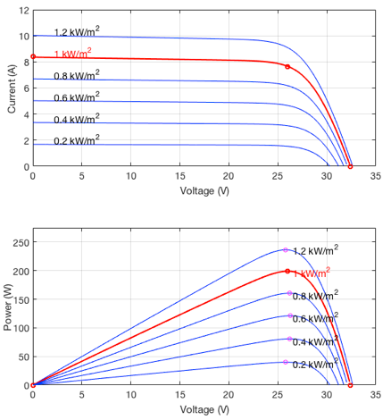

## Trang 4

130
NGO NGOC THANH, NGUYEN PHUNG QUANG
Figure 2.
I-V curves at constant irradiation (1kW/m2) and different temperatures
2.4.
Connection topologies of PV array
Many alternative array interconnection topologies have been proposed in [20], they in-
clude: Series array (Figure 4a), parallel array (Figure 4b), series-parallel array (SP) (Figure
4c), total-cross-tied (Figure 4d), bridge-link (BL) (Figure 4e) and honey-comb (HC) (Figure
4f). Moreover the advantages and disadvantages of each method are explained [20]. Connect
solar modules are connected in series in order to increase the total voltage and in parallel to
increase the total current.
Under non-homogeneous solar irradiation, each PV module will operate with different

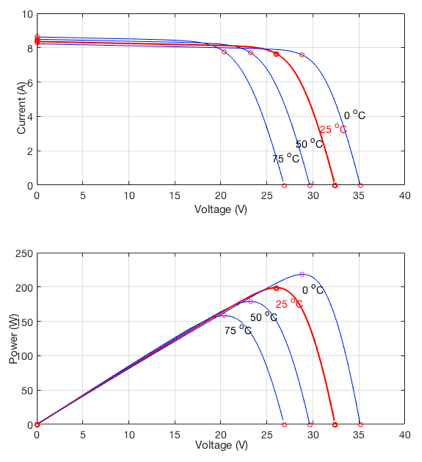

## Trang 5

SIMULATION OF RECONFIGURATION SYSTEM
131
Figure 3.
Important points in the characteristic curves of a solar panel
P-V characteristics resulting in output DC current. Based on the physical properties, when
the PV modules connected in series, the current will be the smallest current, the voltage
is the total voltages; When the PV modules are connected in parallel, the voltage is the
smallest voltage, the current is the total currents. This leads to a decrease in the output
power of the PV system. In the next part of the paper, the reconfiguration strategy for TCT
topology was introduced to increase the efficiency of PV system under non-homogeneous
solar irradiation.
3.
RECONFIGURATION STRATEGY FOR TCT TOPOLOGY
Reconfiguration strategy for total-cross-tied (TCT) topology is shown in details in [29].
TCT topology (Figure 4d) combining with DES switching matrix [27] (Figure 5a) is allowed
from the initial TCT interconnection. As a result, through the switching operations, a new
TCT interconnection with any configuration can be established (Figure 5b).
In our configuration, an ampere meter and a voltmeter are installed at each PV panel

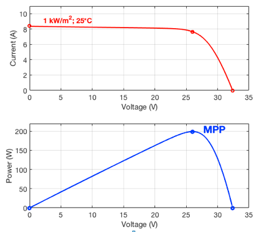

## Trang 6

132
NGO NGOC THANH, NGUYEN PHUNG QUANG
Figure 4.
(a) Series array, (b) parallel array, (c) series-parallel array, (d) total-cross tied
array, (e) bridge-link array and (f) honey-comb array [20]
to measure current and voltage. Based on the current and the voltage measured from each
PV panel, the formula to calculate the irradiation level [33] can be used to estimate the
irradiation level obtained from the PV panels: Example of an equation
Gij = α
Iij + I0
e
Vij
nVT −1)

,
(1)
where Gij the estimated irradiance, Iij and Vij are the measured current and voltage, re-
spectively, and α, I0, and nVT are a set of parameters which can be evaluated from the values
of the ISC, the VOC, and the maximum power operating point of the PV module given in
the data sheets of the manufacturer, respectively.
In the generator TCT topology shown in Figure 5b, if we denote Gij as the irradiance
values of the PV panel located on row i and column j in TCT circuit, the total irradiation

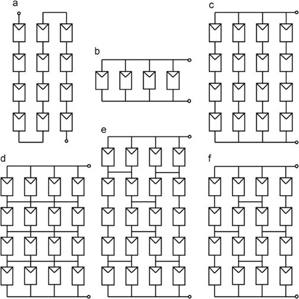

## Trang 7

SIMULATION OF RECONFIGURATION SYSTEM
133
of row i known as Gi is defined as
Gi =
ni
X
j=1
Gij.
(2)
Thus, the total irradiation G can be computed as in the following equation
G =
m
X
i=1
Gi.
(3)
The number of modules N can be synthesized as the following
N =
m
X
i=1
ni,
(4)
where ni is the number of PV panels that were connected in parallel and are located on
row i. Note that the number of rows, in which the TCT circuit can be arranged m must be
compatible with the inverter input voltage operating range. In order to maximize the output
power of the TCT connection, the sum of irradiance on each row after reconfiguration should
be equal or close to the average level
avg = G
n .
(5)
After reconfiguration, equalization index (EI) [20] for the new configuration is equal to
EI = max
i (Gi) −min
i (Gi).
(6)
To the end, the configuration with the minimum EI index that generates the maximum
output power is an optimal configuration.
In Figure 6, the PV system includes 4 PV modules, connected TCT topology with dif-
ferent irradiance on each module in turn is 100W/m2, 100W/m2, 800W/m2, 1000W/m2.
With an initial configuration, the P-V characteristic is green line with peak power at Pmax =
79.60W. By using the DES switching matrix and Controller, the PV system reconfiguration
to optimal configuration by changing position of module 3 from row 2 to row 1. Then, the
P-V characteristic of PV system is red line with peak power increase to Pmax = 368.6W.
In order to find out the optimal configuration for PV array, we use a hybrid algorithm
which is published in [22, 29]. Dynamic programming (DP) [29] is used for Subset Sum
problem in “Knapsack problems”.
DP technique assesses for each panel the power able
to be supplied and inserts it into a dynamic array, which gives rise to the connections
between panels. With an intelligent method, DP select panels with total irradiation that are
equalization and then arrange them in a separated row. However, DP offers the best result
in almost all cases, but in some special situations DP does not bring good results. Smart
choice (SC) [22] proposed to overcome the special case of DP. Finally, SC combined with DP
in order to create a hybrid algorithm and obtain better results as compared to established
methods for irradiance equalization. Diagram of hybrid algorithm is shown in Figure 7.
In the paper, we use Matlab-simulink environment to simulate the operation of RS for
optimal PV array configuration. Simulation is executed on PV system including 9 PV mo-
dules operating under non-homogeneous solar irradiance. Based on the irradiation received

## Trang 8

134
NGO NGOC THANH, NGUYEN PHUNG QUANG
Figure 5.
a) Dynamic electrical scheme (DES) switching matrix [27]; b) Generator TCT
topology
Figure 6.
PV system before and after reconfiguration based on irradiance equalization

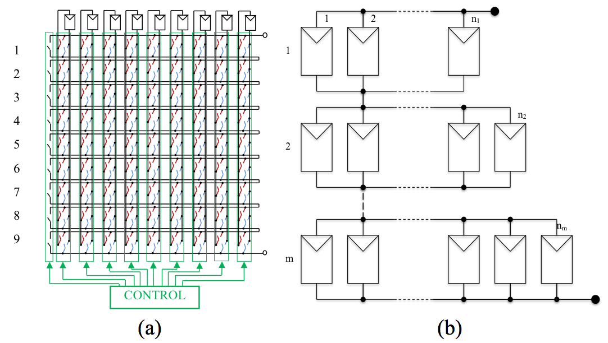

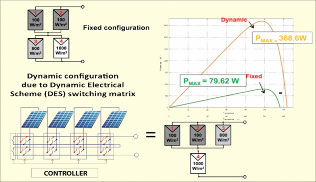

## Trang 9

SIMULATION OF RECONFIGURATION SYSTEM
135
Figure 7.
Hybrid algorithm
from the PV modules, irradiance equalization algorithms as proposed can be used to find
the optimal configuration. Consequently, the controller controlling DES switching matrix
reconfiguration PV system from initial configuration to optimal configuration, PV system
will operate at maximum power.
4.
MATLAB SIMULATION
There have been several publications using Matlab-Simulink to simulate PV module
operation under non-homogeneous solar irradiance [1, 5, 8, 9, 17, 24, 28] which mainly focus
on the simulation of PV module operation, thereby graphing features I-V and P-V. In this
part, we mainly focus on simulation of RS to verify behavior of the system. Hence, we do
not focus on how to simulate PV module under non-homogeneous solar radiation, we use
the result of “partial shading of a PV module” in [21] for simulating PV module operation.
Matlab simulation (Figure 8) includes four main parts: input data; PV modules, hybrid

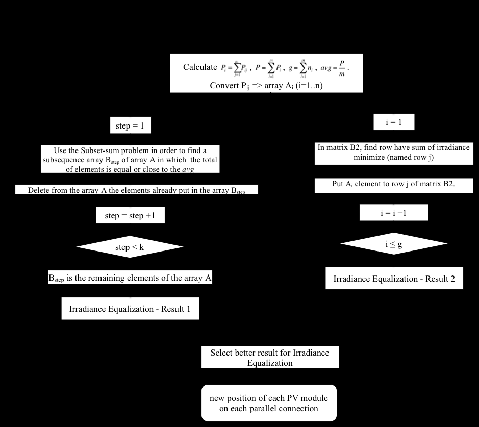

## Trang 10

136
NGO NGOC THANH, NGUYEN PHUNG QUANG
algorithm, DES switching matrix. A flowchart of the simulation is shown in Figure 9.
Figure 8.
Matlab simulation for PV system
Figure 9.
Flowchart of the simulation

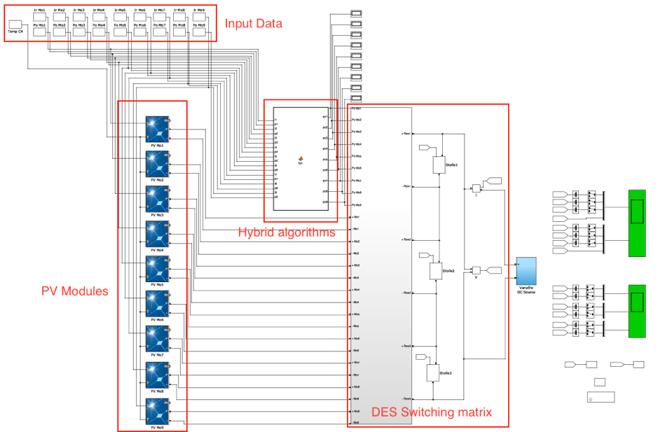

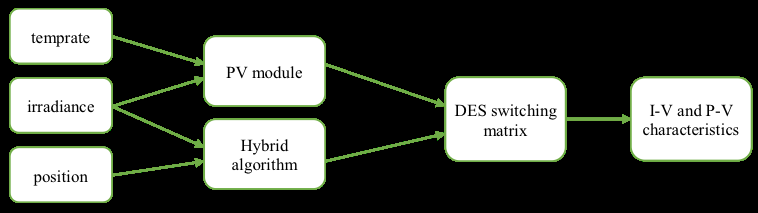

## Trang 11

SIMULATION OF RECONFIGURATION SYSTEM
137
4.1.
PV module
It is the result of PV module simulation under conditions of non-homogeneous irradiance
at [21], the PV module with the input data being irradiance (W/m2) and temperature (◦C);
and the output data being DC current (+ and -). The model parameter is selected as in the
standard PV module data-sheet parameter: ISC, VOC, rated current IR at MPP and rated
voltage VR at MPP under standard test conditions (1kW/m2, 25◦C) (Figure 10).
Figure 10.
Parameters of PV module
Figure 11.
Schematic design of DES switching matrix
When the PV system operates under conditions of non-homogeneous solar irradiance,
depending on the irradiance level received, each PV module brings forward a different DC
current. In this simulation, we focus on the PV system working at non-homogeneous irradi-
ance, hence we chose the ideal condition for PV modules is 25◦C.

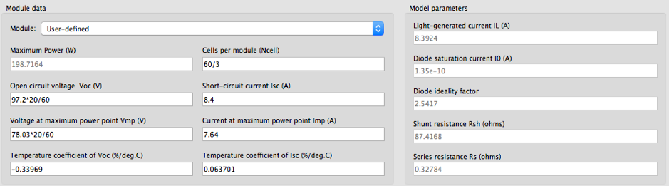

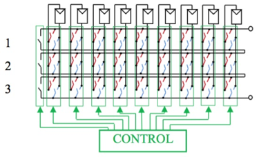

## Trang 12

138
NGO NGOC THANH, NGUYEN PHUNG QUANG
Figure 12.
DES switching matrix
Figure 13.
Input data for simulation

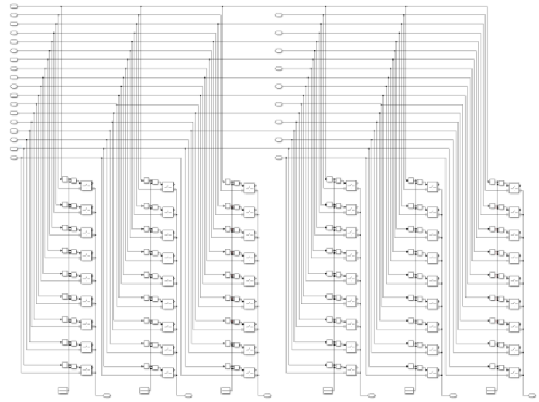

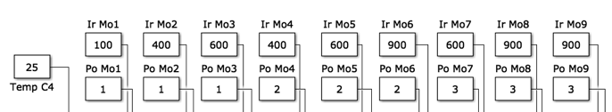

## Trang 13

SIMULATION OF RECONFIGURATION SYSTEM
139
4.2.
Hybrid algorithm
In this section, we modelize hybrid algorithm in a Matlab function block. The main
aim of the hybrid algorithm is to seek the optimal connection configuration of the system to
archive the best performance. The hybrid algorithm is shown in Figure 7. The input data
of the hybrid algorithm are irradiances and positions of each PV module. The result is the
optimal configuration: new position of each PV module on each parallel connection in TCT
topology.
4.3.
DES switching matrix
Figure 11 demonstrates a schematic design of the DES switching matrix designed for 9
PV modules. Each PV module is connected into three rows via switches. It can change the
Figure 14.
PV system before reconfiguration (a-c) and after reconfiguration with RS (b-d)

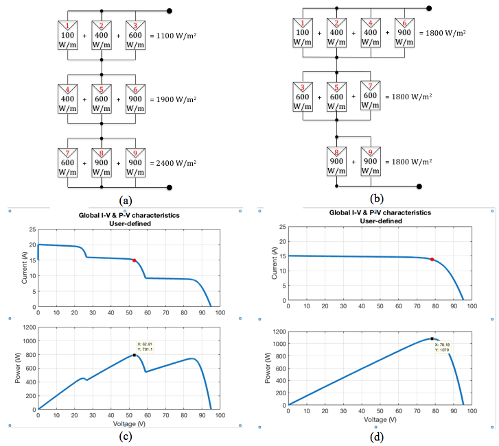

## Trang 14

140
NGO NGOC THANH, NGUYEN PHUNG QUANG
position of the connection between the rows. Switching from row x to row y can be done
by opening switch at row x and closing switch at row y. For example, PV module want to
connect to row 1: switches in row 2 and 3 are open, switch in row 1 is close.
Through opening/closing the switches in DES, PV system can change the configuration
from the initial TCT topology to any TCT topology with up to three rows.
Figure 12 is an illustration of the basis of schematic design in Matlab-simulink environ-
ment with the input data for each PV module as: DC current and the new position after
the reconfiguration. DES switching matrix is restructured within three circuits connected in
parallel to ensure the input assumptions for the inverters. Based on the new position of each
PV module, the controller is able to control ideal switches for the corresponding connection
configuration. The result of the DES switching matrix is DC currents of the PV system.
4.4.
Result of simulation
Simulation with 9 PV modules is connected as shown in Figure 14a.
At the initial
configuration, the PV modules received different irradiance.
Hence, total irradiation in
the parallel circuit is different. The I-V and P-V characteristics of the system before the
reconfiguration with Pmax = 791.1W is demonstrated in Figure 14c.
With PV system as seen in Figure 14a (input data of Matlab simulation show in Figure
13), the hybrid algorithm provides an optimal PV configuration.
Then, DES switching
matrix used the result of hybrid algorithm to change the connection of PV system from
initial configuration to the optimal configuration (Figure 14b with irradiance equalization
on each row of PV system). The position of PV modules 7, 4, 6, 3 has changed. After using
the reconfiguration system, P-V characteristics (Figure 14d) have been improved markedly
with Pmax = 1079W (performance increases by 29%).
5.
CONCLUSIONS
A Matlab/Simulink software has been developed to simulate the behavior of PV modules
with different configurations under non-homogeneous of solar irradiance. The effect of the
reconfiguration system on PV characteristics under partially shaded conditions has been
modelized in the study. Additionally, an experimental measurement has been performed
and validity of the simulation software has been verified. The results show that the software
is a promising tool for further research on the effectiveness of reconfiguration algorithms in
solar power plant.
REFERENCES
[1] “Pv module simulink models,” ECEN 2060 Renewable Sources and Efficient Electrical Energy
Systems. [Online]. Available: [online]Available:http://ecee.colorado.edu/∼ecen2060/materials/
simulink/PV/PV module model.pdf
[2] “Electricity from sunlight: an introduction to photovoltaics,” Choice: Current Reviews for Aca-
demic Libraries, vol. 48, no. 5, pp. 933–933, 2011.
[3] “Trends in photovoltaic applications. survey report of selected iea countries between 1992 and
2012,” Report, 2013.

## Trang 15

SIMULATION OF RECONFIGURATION SYSTEM
141
[4] M. Alahmada, M. A. Chaabanb, S. kit Laua, J. Shic, and J. Neald, “An adaptive utility in-
teractive photovoltaic system based on a flexible switch matrix to optimize performance in
real-time,” Solar Energy, vol. 86, p. 951963, 2012.
[5] B. A. Alsayid, S. Y. Alsadi, J. S. Jallad, and M. H. Dradi, “Partial shading of pv system
simulation with experimental results,” Smart Grid and Renewable Energy, vol. 4, pp. 429–435,
2013.
[6] M. Balato, L. Costanzo, and M. Vitelli, “Maximum power point tracking techniques,” Wiley
Encyclopedia of Electrical and Electronics Engineering, pp. 1–26, 2016.
[7] F. Belhachata and C. Larbesb, “Modeling, analysis and comparison of solar photovoltaic array
configurations under partial shading conditions,” Solar Energy, vol. 120, p. 399418, 2015.
[8] N. Belhaouas, M. A. Cheikh, A. Malek, and C. Larbes, “Matlab-simulink of photovoltaic system
based on a two-diode model simulator with shaded solar cells,” Revue des Energies Renouvelables,
vol. 16, pp. 65–73, 2013.
[9] U. S. Bhadoria and R. Narvey, “Modeling and simulation of pv arrays under psc (partial shading
conditions),” International Journal of Electronic and Electrical Engineering, vol. 7, pp. 423–430,
2014.
[10] P.-C. Chena, P.-Y. Chena, Y.-H. Liua, J.-H. Chena, and Y.-F. Luob, “A comparative study on
maximum power point tracking techniques for photovoltaic generation systems operating under
fast changing environments,” Solar Energy, vol. 119, p. 261276, 2015.
[11] C. Delinea, A. Dobosa, S. Janzoua, J. Meydbrayb, and M. Donovanb, “A simplified model of
uniform shading in large photovoltaic arrays,” Solar Energy, vol. 96, p. Pages 274282, 2013.
[12] M. Z. S. El-Dein, M. Kazerani, and M. M. A. Salama, “Optimal photovoltaic array reconfigura-
tion to reduce partial shading losses,” IEEE Transactions on Sustainable Energy, vol. 4, no. 1,
p. 9, 2012.
[13] N. Femia, G. Petrone, G. Spagnuolo, and M. Vitelli, Power Electronics and Control Techniques
for Maximum Energy Harvesting in Photovoltaic systems, 2012.
[14] M. C. A. Garcia, W. Herrmann, W. Bohmer, and B. Proisy, “Thermal and electrical effects cau-
sed by outdoor hot-spot testing in associations of photovoltaic cells,” Progress in Photovoltaics,
vol. 11, no. 5, pp. 293–307, 2003.
[15] N. Gokmena, E. Karatepea, F. Ugranlia, and S. Silvestreb, “Voltage band based global mppt
controller for photovoltaic systems,” Solar Energy, vol. 98, Part C, p. 322334, 2013.
[16] S. GS, D. V. P, M. G, P. D, and M. A, “A review of ir thermography applied to pv systems,”
Environment and Electrical Engineering (EEEIC), 2012 Eleventh international conference, 2012.
[17] C. Keles, B. B. Alagoz, M. Akcin, A. Kaygusuz, and A. Karabiber, “A photovoltaic system
model for matlab/simulink simulations,” 4th International Conference on Power Engineering,
2013.
[18] A. Kouchaki, H. Iman-Eini, and B. Asaei, “A new maximum power point tracking strategy for pv
arrays under uniform and non-uniform insolation conditions,” Solar Energy, vol. 91, p. 221232,
2013.

## Trang 16

142
NGO NGOC THANH, NGUYEN PHUNG QUANG
[19] Y.-H. Liua, J.-H. Chena, and J.-W. Huangb, “Global maximum power point tracking algorithm
for pv systems operating under partially shaded conditions using the segmentation search met-
hod,” Solar Energy, vol. 103, p. 350363, 2014.
[20] D. L. Manna, V. L. Vigni, E. R. Sanseverino, V. D. Dio, and P. Romano, “Reconfigurable elec-
trical interconnection strategies for photovoltaic arrays: A review,” Renewable and Sustainable
Energy Reviews, 2014.
[21] MathWorks, “Partial shading of a pv module,” http://www.mathworks.com/help/physmod/sps
/examples/partial-shading-of-a-pv-module.html.
[22] T. N. Ngoc, Q. N. Phung, L. N. Tung, E. R. Sanseverino, P. Romano, and F. Viola, “Increa-
sing efficiency of photovoltaic systems under non-homogeneous solar irradiation using improved
dynamic programming methods,” Solar Energy, vol. 150, pp. 325–334, 2017.
[23] D. Nguyen and B. Lehman,
“An adaptive solar photovoltaic array using model-based
reconfiguration algorithm,” Ieee Transactions on Industrial Electronics, vol. 55, no. 7, pp.
2644–2654, 2008. [Online]. Available: ⟨GotoISI⟩://WOS:000257582900010
[24] X. H. Nguyen, “Matlab/simulink based modeling to study effect of partial shadow on solar
photovoltaic array,” Environmental Systems Research, 2015.
[25] H. Obane, K. Okajima, T. Oozeki, and T. Ishii, “Pv system with reconnection to improve output
under nonuniform illumination,” IEEE Journal of Photovoltaics, vol. 2, no. 3, pp. 341–347, 2012.
[26] G. V. Quesada, J. J. N. Vera, F. G. Gispert, and R. Pique, “Irradiance equalization method for
output power optimization in plant oriented grid-connected pv generators,” Power Electronics
and Applications, 2005 European Conference on, pp. 10, P.10, 2005.
[27] P. Romano, R. Candela, M. Cardinale, V. L. Vigni, D. Musso, and E. R. Sanseverino, “Opti-
mization of photovoltaic energy production through an efficient switching matrix,” Journal of
Sustainable Development of Energy, Water and Environment Systems, vol. 1, no. 3, pp. 227–236,
2013.
[28] S. Said, A. Massoud, M. Benammar, and S. Ahmed, “A matlab/simulink-based photovoltaic
array model employing simpowersystems toolbox,” Journal of Energy and Power Engineering,
vol. 6, pp. 1965–1975, 2012.
[29] E. R. Sanseverino, N. N. Thanh, M. Cardinale, V. L. Vigni, D. Musso, P. Romano, and F. Viola,
“Dynamic programming and munkres algorithm for optimal photovoltaic arrays reconfiguration,”
Solar Energy, vol. 122, p. Pages 347358, 12/2015.
[30] S. Silvestre, A. Boronat, and A. Chouder, “Study of bypass diodes configuration on pv modules,”
Applied Energy, vol. 86, no. 9, pp. 1632–1640, 2009.
[31] J. Storey, P. Wilson, and D. Bagnall, “Improved optimization strategy for irradiance equalization
in dynamic photovoltaic arrays,” Power Electronics, IEEE Transactions on, vol. 28, no. 6, p. 11,
2012.
[32] Uezato, M. Veerachary, and T. Senjyu, “Voltage-based maximum power point tracking control
of pv system,” IEEE Transactions on Aerospace and Electronic Systems, vol. 38, no. 1, pp. 262
– 270, Jan 2002.

## Trang 17

SIMULATION OF RECONFIGURATION SYSTEM
143
[33] G. Velasco,
F. Guinjoan,
and R. Pique,
“Electrical pv array reconfiguration strategy
for
energy
extraction
improvement
in
grid-connected
pv
systems,”
Ieee
Transactions
on
Industrial
Electronics,
vol.
56,
no.
11,
pp.
4319–4331,
2009.
[Online].
Available:
⟨GotoISI⟩://WOS:000270720100003
[34] A. Woytea, J. Nijsa, and R. Belmans, “Partial shadowing of photovoltaic arrays with different
system configurations: literature review and field test results,” Solar Energy, vol. 74, p. 17, 2003.
[35] F. Zhang, J. Maddy, G. Premier, and A. Guwy, “Novel current sensing photovoltaic maximum
power point tracking based on sliding mode control strategy,” Solar Energy, vol. 118, p. 8086,
2015.
[36] J. Zhaoa, X. Zhoub, Y. Mab, and W. Liub, “A novel maximum power point tracking stra-
tegy based on optimal voltage control for photovoltaic systems under variable environmental
conditions,” Solar Energy, vol. 122, p. 640649, 2015.
Received on February 03, 2017
Revised on September 12, 2018
